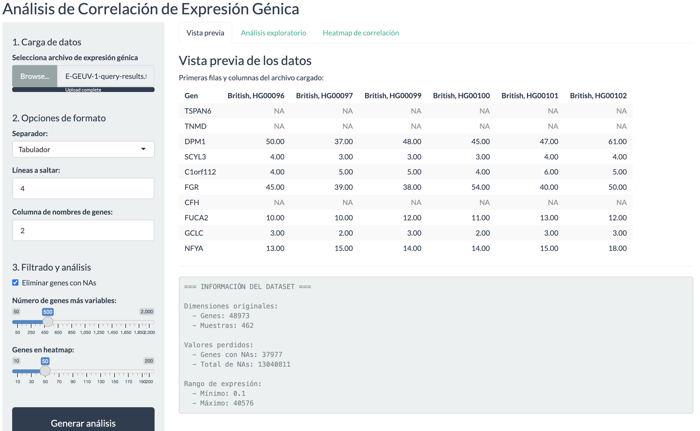
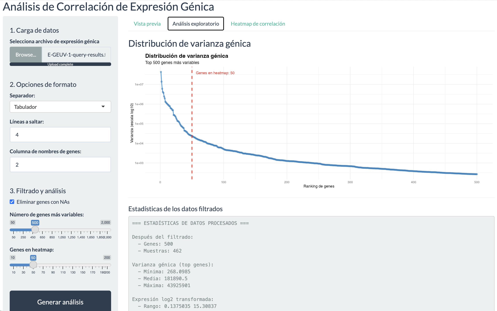
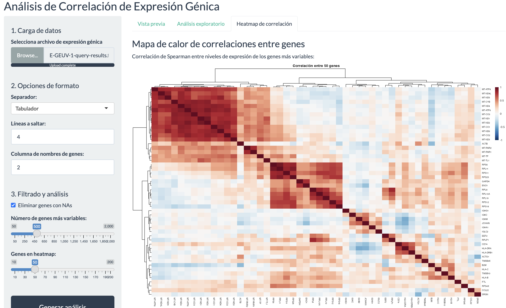

```{r setup, include=FALSE}
knitr::opts_chunk$set(echo = TRUE, warning = FALSE, message = FALSE, 
                      fig.width = 10, fig.height = 6)
```

# Sección 1. Fundamentos de programación y BBDD (5 puntos)

## Ejercicio 1 (1 punto)

### R.1a

Se pide de cargar los datos y mostras los estadísticos importantes así como, en caso que sea necesario, los valores faltantes y como tratarlos.

El primer paso es poder instalar las librerías que necesitaremos más adelante. 

```{r}
if (!require("mlbench")) install.packages("mlbench")
library(mlbench)
data("BreastCancer")
```

```{r}
# Cargamos el resto de librerías de utilidades aquí
library(ggplot2)
library(dplyr)
```

Analizaremos los datos iniciales y su estructura

```{r}
# Exploración inicial
cat("Dimensiones del dataset:", dim(BreastCancer), "\n")
cat("Estructura del dataset:\n")
str(BreastCancer)
```

Por lo que observamos tenemos **699 observaciones**, y **11 features** de los cuáles los datos son del tipo multivariado, es decir que tenemos diferentes tipos de valores. De hecho de las 11 variables, una de las cuales es una variable de carácter, 9 son ordenadas o nominales y 1 es una clase objetivo así estructurados:

* Sample_code_number	ID	Categorical
* Clump_thickness	Feature	Ordered factor con 10 niveles
* Uniformity_of_cell_size	Feature	Ordered factor con 10 niveles
* Uniformity_of_cell_shape	Feature	Ordered factor con 10 niveles
* Marginal_adhesion	Feature	Ordered factor con 10 niveles
* Single_epithelial_cell_size	Feature	Ordered factor con 10 niveles
* Bare_nuclei	Feature	factor con 10 niveles
* Bland_chromatin	Feature factor con 10 niveles
* Normal_nucleoli	Feature factor con 10 niveles
* Mitoses	Feature factor con 9 niveles

Y la variable dependiente **Class** que define si el tumor es benigno=1 o maligno=2

Aunque desde la página oficial de [UCI Machine Learning](https://archive.ics.uci.edu/dataset/15/breast+cancer+wisconsin+original) se indican diferentes tipos de valores y la propia clase define **benigno=2** y **maligno=4**, trataremos los valores a nivel de exploratorio de análisis univariante y finalmente bivariante respecto a la clase predictora.

Además, desde un primer vistazo las variables numéricas discretas ordenadas, tienen diferente tipo de nivel, que por tal motivo, hay que ver de poder realizar un análisis exhaustivo para entender como aplicar la lógica del contexto a nuestro caso de uso.

Para poder ver un resumen muy acotado de nustro dataset, lanzaremos el comando de **summary**, excluyendo la ID, que por el momento no es importante para nuestro análisis.

```{r}
# Resumen estadístico de las variables principales
summary(BreastCancer[, c("Cl.thickness", "Cell.size", "Cell.shape", 
                         "Bare.nuclei", "Marg.adhesion", "Epith.c.size",
                         "Bl.cromatin", "Normal.nucleoli", "Mitoses",
                         "Class")])
```
El primer dato que tenemos es la proporción que hay entre las dos clases:

```{r}
class_ratio <- prop.table(table(BreastCancer$Class))
class_ratio
```

```{r}
round(class_ratio['benign'],2)
round(class_ratio['malignant'],2)
```
Tenemos una proporción del 66% de casos benignos y del 34% del resto de casos. No se trata de un dataset desbalanceado, al contrario, en fase de modelación debemos tener en cuenta los casos de poder predecir correctamente cuando sean 'malignos', que solamente tenemos identificados 241 casos.

Desde este pequeño *summary* observamos la composición de cada una de las variables, y en particular nos llama la atención la variable **Bare.nuclei**, la única del dataset donde tenemos 16 valores faltantes.

Analizaremos este punto:

```{r}
# Verificación de valores perdidos
na_count <- sapply(BreastCancer, function(x) sum(is.na(x)))
print(na_count[na_count > 0])
```

No existe una regla fija para poder tratar los valores faltantes, sin embargo existen diferentes métodos. Al contrario, tenemos varios, quizás dependa del caso, pero hay formas de ver como poder imputar los valores nulos a un valor estadístico importante como promedio, moda, o realizar unas imputaciones por aprendizaje automático así también aplicar un modelo supervisado o también un modelo no supervisado.

Pero sí hay una regla, que si los valores no perjudican al modelo, se podría tratar por dos vías, lanzando unas hipótesis en fase de test. Si afectan los valores faltantes por ser importantes, entonces habrá que realizar una imputación y, para nuestro caso de uso, poder asumir que son correctos, con que nivel de confianza y poder lanzar un modelo de aprendizaje automático. Comparar sucesivamente en caso de eliminarlos y analizar si afectaría este resultando, en qué medida y con qué nivel de confianza.

Por el momento, trataremos los valores nulos como poco significativos, siendo solo un ~2% de los valores, por lo que optaremos de eliminarlos.

Haciendo un pequeño resumen de este punto 1a.

1. Los valores nulos representan solo un 2.3% del total de observaciones (16/699).
2. La eliminación no comprometerá significativamente el análisis.
3. Es más conservador que la imputación para este tipo de análisis diagnóstico.

```{r limpieza_datos}
# Eliminaremos las observaciones con valores perdidos
Breast_cleaned <- BreastCancer %>% 
  na.omit()
```

Procederemos a la conversión a valores numéricos las características para poder modelarlas en los procesos siguientes:

"Cl.thickness", "Cell.size", "Cell.shape", "Bare.nuclei", "Marg.adhesion", "Epith.c.size",                        "Bl.cromatin", "Normal.nucleoli", "Mitoses"

```{r}
columns = c("Cl.thickness", "Cell.size", "Cell.shape", 
                         "Bare.nuclei", "Marg.adhesion", "Epith.c.size",
                         "Bl.cromatin", "Normal.nucleoli", "Mitoses")

Breast_numeric <- Breast_cleaned

for (col in columns) {
  Breast_numeric[[col]] <- as.numeric(as.character(Breast_numeric[[col]]))
}

```


Se muestran gráficamente las distribuciones 

```{r}
# Paleta de colores para diagnóstico
color_diag <- c("benign" = "#2E7D32", "malignant" = "#C62828")
color_diag_labels <- c("benign" = "Benigno", "malignant" = "Maligno")

table_class <- table(Breast_numeric$Class)

p1 <- ggplot(Breast_numeric, aes(x = Class, fill = Class)) +
  geom_bar(alpha = 0.8, color = "black") +
  geom_text(stat = 'count', aes(label = after_stat(count)), 
            vjust = -0.5, size = 5, fontface = "bold") +
  scale_fill_manual(values = color_diag, labels = color_diag_labels) +
  labs(title = "Distribución de Diagnósticos",
       subtitle = sprintf("Total: %d casos | Benignos: %d (%.1f%%) | Malignos: %d (%.1f%%)",
                         sum(table_class), 
                         table_class[1], 100*table_class[1]/sum(table_class),
                         table_class[2], 100*table_class[2]/sum(table_class)),
       x = "Diagnóstico",
       y = "Frecuencia") +
  scale_x_discrete(labels = color_diag_labels) +
  theme_minimal() +
  theme(plot.title = element_text(face = "bold", size = 16),
        legend.position = "none",
        axis.text = element_text(size = 12))

print(p1)
```

Con la eliminación de los valores nulos, mantenemos la proporción similar para los casos benignos y malignos.


***

### R.1b

Para el segundo punto se pide de realizar un gráfico de dispersión entre `Cell.size` (uniformidad del tamaño celular) y `Cell.shape` (uniformidad de la forma celular), diferenciando por colores el tipo de diagnóstico (Class: maligno vs benigno). Además se pide de interpretar visualmente si existe una separación clara entre ambos grupos.

Visto que este tipo de gráfico pide claramente si existe o no una cierta relación positiva o negativa entre las dos variables analizadas, procederemos con el análisis.

```{r grafico_dispersion}
# Gráfico de dispersión con diferenciación por diagnóstico
ggplot(Breast_cleaned, aes(x = Cell.shape, y = Cell.size, color = Class)) +
  geom_point(alpha = 0.6, size = 3) +
  scale_color_manual(values = c("benign" = "#2E7D32", "malignant" = "#C62828"),
                     labels = c("Benigno", "Maligno")) +
  labs(title = "Relación entre uniformidad de forma y tamaño celular",
       subtitle = "Diferenciación por diagnóstico de cáncer de mama",
       x = "Uniformidad de la forma celular (1-10)",
       y = "Uniformidad del tamaño celular (1-10)",
       color = "Diagnóstico") +
  theme_minimal() +
  theme(plot.title = element_text(face = "bold", size = 14),
        legend.position = "bottom")
```

Del gráfico podemos observar el siguiente escenario. Los valores identificados como **malignos** se encuentran con la uniformidad de la forma celular más alto a partir de 5 a 10, mientras que los valores de los cosos **benignos** se encuentran por debajo del valor 1 a 3 en gran mayoría. 


```{r}
cor(as.numeric(Breast_cleaned$Cell.shape), as.numeric(Breast_cleaned$Cell.size))
```

A nivel de tamaño, existe una fuerte alineación diagonal, correlación en un 90% donde indica que las células tumorales tienden a ser irregulares tanto en tamaño como en forma simultáneamente.

```{r}
cor.test(as.numeric(Breast_cleaned$Cell.shape), as.numeric(Breast_cleaned$Cell.size))
```
Confirmado que también a un NC del 95%, utilizando el test de Person, la correlación es de un 90%. De hecho viendo los resultados el p-value < 0.05, la correlación es estadísticamente significativa.

Sin embargo, viendo que Person, debería utilizar valores continuos y no discretos, se analizará con el test de Spearman, que debería ser más adecuado para tal fin.

```{r}
cor.test(as.numeric(Breast_cleaned$Cell.shape),
         as.numeric(Breast_cleaned$Cell.size),
         method = 'spearman')
```
No cabe duda que el valor p-value es pequeño, por lo que la correlación es estadísticamente significativa alta por lo que rechazaremos la hipótesis nula.

***

### R.1c

A partir de la ajuste de un modelo de regresión linel con `Cell.size` como variable dependiente y `Cell.shape` como variable independiente interpretaremos los resultados.


```{r modelo_lineal}
# Ajustar modelo de regresión lineal
modelo_lm <- lm(Cell.size ~ Cell.shape, data = Breast_numeric)

# Resumen del modelo
summary(modelo_lm)

# Intervalos de confianza para los coeficientes al 95%
confint(modelo_lm)
```

Analizaremos e interpretaremos los coeficientes del modelo, comenzando con el **intercept** o $\beta_0 = 0.15913$ que significa cuando `Cell.shape` tiene un valor de bajo, el valor predicho de `Cell.size` sería aproximadamente 0.159. En la práctica, esto representa el punto de partida de la línea de regresión. Por **significación estadística** el $p-valor = 0.0286 < 0.05$, por lo que es estadísticamente significativo al nivel del 5%.

Si nos fijamos por el **coeficiente de Cell.shape** $\beta_1 = 0.93047$, significa que por cada unidad de aumento en la uniformidad de la forma celular dada de `Cell.shape`, la uniformidad del tamaño celular `Cell.size` aumenta en promedio de casi 1 unidad, en realidad el valor es 0.9305, manteniendo todo lo demás constante.

Respecto al **intervalo de confianza al 95%**: [0.8980, 0.9629], que indica que al 95% podemos estar seguros de que el verdadero coeficiente poblacional se encuentra en este intervalo.

Para el resto de valores, por ejemplo por la **significación estadística**, tenemos:
  - Valor t = 56.283 (muy alto)
  - p-valor < 2.2e-16 (prácticamente 0)
  - Altamente significativo (***)

Interepretaremos el resto de indicadores, por ejemplo **la bondad de ajuste**:

El **Multiple R-squared = 0.8231** que significa que un 82.31% de la variabilidad en `Cell.size` puede ser explicada por `Cell.shape`. Esto indica una **relación muy fuerte** entre ambas variables.
Si comparamos con el análisis de correlación de Spearman, tenemos casi la misma relación, 89,49% vs 82,31%.

También nos indica el valor deñ **error estándar residual = 1.29**, que es la desviación típica de los residuos es 1.29 unidades. Esto nos da una idea de cuánto se desvían, en promedio, las observaciones reales de las predichas por el modelo.

Respecto al **F-estadístico = 3168 (p < 2.2e-16)** significa que el modelo en su conjunto es altamente significativo. La relación entre `Cell.size` y `Cell.shape` no es *random*.

Buscando algo más de contexto y referencias para una interpretación correcta en este mismo contesto del caso de uso de **Breast Cancer**, entre las dos variables tenemos una relación casi perfecto, con un coeficiente de 0.9305 el que hay una relación casi 1:1 entre la uniformidad de la forma celular y la uniformidad del tamaño celular. Cuando las células tienen formas más anormales (valores más altos de `Cell.shape`), casi siempre también tienen tamaños más variables (valores más altos de `Cell.size`).

Investigando en los papers de referencias del mismo servidor proporcionado, indicado en bibliografías una fuerte correlación entre ambas características son manifestaciones de un mismo fenómeno subyacente que es denominada la anormalidad celular.
En la práctica clínica, si se observa una alta uniformidad en la forma celular, es muy probable que también se observe alta uniformidad en el tamaño celular, y viceversa. Como ambas variables son indicadores importantes del cáncer de mama, ya que valores más altos (más anormales) están asociados con tumores malignos.


***

### R.1d

Realizamos ahora un análisis de los residuos graficando los valores influyentes a través de la distancia de Cook que viene indicada en la documentación en `influence.mesaures` del paquete {stats}: 

https://www.rdocumentation.org/packages/car/versions/1.0-2/topics/Deletion%20Diagnostics

```{r analisis_residuos, fig.height=8}
# Gráficos diagnósticos del modelo
par(mfrow = c(2, 2))
plot(modelo_lm)
par(mfrow = c(1, 1))

# Identificar valores influyentes a través de la distancia de Cook
cook_d <- cooks.distance(modelo_lm)
influential <- which(cook_d > 4/nrow(Breast_numeric))
cat("Observaciones influyentes (Cook's D > 4/n):", length(influential), "\n")
if(length(influential) > 0) {
  cat("Índices:", influential, "\n")
}

# Valores atípicos (residuos estandarizados)
std_resid <- rstandard(modelo_lm)
outliers <- which(abs(std_resid) > 3)
cat("\nObservaciones atípicas (|residuo estandarizado| > 3):", length(outliers), "\n")
if(length(outliers) > 0) {
  cat("Índices:", outliers, "\n")
}

# Leverage alto
hat_values <- hatvalues(modelo_lm)
high_leverage <- which(hat_values > 2*2/nrow(Breast_numeric))
cat("\nObservaciones con leverage alto (> 2p/n):", length(high_leverage), "\n")
```

Probaremos a interepretar los resultados de los **valores influyentes (Cook's Distance > 4/n)** donde 44 observaciones identificadas como influyentes. Las observaciones con distancia de Cook alta tienen un impacto desproporcionado en los coeficientes del modelo. Si se eliminan, podrían cambiar significativamente los resultados del modelo.

Se establece un criterio dado del umbral $4/n = 4/683 \approx 0.00585$ el cuál es un criterio conservador comúnmente usado.

Revisando los **valores atípicos (|residuo estandarizado| > 3)**, tenemos 17 observaciones identificadas como atípicas
Hay casos donde el modelo predice muy mal el valor real de `Cell.size` dado el valor de `Cell.shape`. Los residuos estandarizados mayores a 3 en valor absoluto ocurren con una probabilidad muy baja (< 0.3%) si los supuestos del modelo son correctos.

Respecto a las **observaciones con alto leverage (> 2p/n)** tenemos 65 observaciones con leverage alto. De estas observaciones tienen valores inusuales de la variable independiente `Cell.shape`. El leverage mide cuánto influye una observación en la posición de la línea de regresión debido a su posición en el espacio de X (no por su valor de Y).

Observando y haciendo un análisis de los gráficos diagnósticos tenemos de un lado el gráfico de los `Residuos vs Valores Ajustados` que nos consente de verificar la homocedasticidad (varianza constante de residuos), buscando un patrón deseado, es decir los residuos distribuidos aleatoriamente alrededor de 0, sin patrones sistemáticos. Podríamos tener una posible heterocedasticidad si hay forma de embudo además de encontrar patrones curvilíneos que nos indican no linealidad.

Respecto al **Gráfico Q-Q de normalidad** permite verificar normalidad de los residuos buscando puntos cerca de la línea diagonal y posibles problemas observados, con unas desviaciones en las colas (especialmente valores extremos). Los 17 valores atípicos identificados probablemente aparezcan como puntos alejados de la línea

El gráfico **Scale-Locatio** que buscando informaciones adicionales es dada de la `Raíz cuadrada de residuos estandarizados vs valores ajustados`, permite verificar homocedasticidad de otra forma, es decir buscar un patrón de una línea aproximadamente horizontal. El posible problema podría dar lugar a una línea con pendiente que indica varianza no constante

El último gráfico de **Residuos vs Leverage** permite identificar observaciones influyentes con unos criterios de las observaciones fuera de las líneas de contorno de Cook's distance (generalmente 0.5 y 1) y una combinación de alto leverage y residuo grande = alta influencia.

A nivel de resumen, hay que buscar ciertas validaciones de los supuestos del modelo, la primera debería ser una **posible violación de normalidad**, ya que con 17 valores atípicos, es probable que los residuos no sigan perfectamente una distribución normal. Luego una **posible heterocedasticidad** que podría haber problemas con la varianza constante. Y por último una **posible no linealidad**, aunque el $R^2$ es alto, podría haber patrones no lineales no capturados.

Verificando la robustez del modelo, buscando la vulnerabilidad a observaciones influyentes y la necesidad de verificación, se debería revisar estas observaciones para determinar si son:
  - Errores de entrada de datos
  - Casos genuinamente diferentes (p.ej., tipos específicos de cáncer)
  - Errores de medición

***

### R.1e

Ajustaremos a un modelo de regresión logística utilizando el paquete `glm`.

```{r modelo_logistico}
# Preparar variable dependiente (malignant = 1, benign = 0)
Breast_numeric <- Breast_numeric %>%
  mutate(Class_binary = ifelse(Class == "malignant", 1, 0))

# Ajustar modelo de regresión logística
modelo_logit <- glm(Class_binary ~ Cell.size + Cell.shape, 
                    data = Breast_numeric,
                    family = binomial(link = "logit"))

# Resumen del modelo
summary(modelo_logit)

# Odds Ratios e intervalos de confianza al 95%
or_coef <- exp(coef(modelo_logit))
or_ci <- exp(confint(modelo_logit))
or_table <- cbind(OR = or_coef, or_ci)
print(or_table)
```

El primer problema que tuvimos que realizar para poder modelar a una regresión logística y dado de las features del tipo `factor`. Por lo que vemos un problema del mismo R que está tratando las variables `Cell.size` y `Cell.shape` como **factores ordenados (ordinales)** en lugar de variables numéricas. Cuando se están utilizando un factor ordenado en un modelo lineal generalizado (GLM), R automáticamente crea **polinomios ortogonales** para representar la relación ordinal (términos .L, .Q, .C, ^4, etc.), lo que no es lo que queremos para este análisis.

Después de convertir a variables numéricas antes del modelo, y binaria nuestra clase target, vamos con la interpretación de los resultados.

Los coeficientes del modelo tenemos de un lado la **Intercept** $\beta_0 = -5.6584$ que nos informa que cuando `Cell.size` como `Cell.shape` son un valor bajo, el logaritmo de la razón de probabilidades (log-odds) de que un tumor sea maligno es -5.6584. El valor de **Odds Ratio** es de $exp(-5.6584) \approx 0.00349$. Básicamente si un tumor con valores mínimos en ambas características (1 en ambas escalas) tiene una odds muy baja (0.00349:1, o aproximadamente 0.35% de probabilidad) de ser maligno. En términos de probabilidad es dada de $p$ = odds/(1+odds) = 0.00349/1.00349 $\approx$ 0.00348 (0.348%).

Respecto al coeficiente de `Cell.size` $\beta_1 = 0.8523$, es decir que por cada unidad de aumento en `Cell.size` (uniformidad del tamaño celular), el log-odds de que un tumor sea maligno aumenta en 0.8523 unidades, manteniendo constante `Cell.shape`. El valor de **Odds Ratio** es $exp(0.8523) \approx 2.345$, por lo que cada unidad de aumento en `Cell.size`, las **odds de que un tumor sea maligno se multiplican por 2.345 veces**, manteniendo constante `Cell.shape`.

Si buscamos un ejemplo práctica a realizar con estos resultados, si un tumor con `Cell.size = 5` tiene aproximadamente 2.35 veces más probabilidades de ser maligno que uno con `Cell.size = 4`, si ambos tienen el mismo valor de `Cell.shape`.
Teniendo en cuenta un **intervalo de confianza al 95%**: [1.73, 3.32], podemos estar 95% seguros de que el verdadero OR está entre 1.73 y 3.32.

Respecto al coeficiente de `Cell.shape` $\beta_2 = 0.8392$, nos indica que por cada unidad de aumento en `Cell.shape` (uniformidad de la forma celular), el log-odds de que un tumor sea maligno aumenta en 0.8392 unidades, manteniendo constante `Cell.size` y con un **Odds Ratio** del $exp(0.8392) \approx 2.315$ y por por cada unidad de aumento en `Cell.shape`, las **odds de que un tumor sea maligno se multiplican por 2.315 veces**, manteniendo constante `Cell.size`.

Para el resto de valores de **Significación estadística**, observamos que ambas variables son altamente significativas, así detalladas:

- **Cell.size**: 
  - z-value = 5.120
  - p-value = 3.06e-07 (***)
  - Altamente significativo (p < 0.001)

- **Cell.shape**:
  - z-value = 5.312
  - p-value = 1.08e-07 (***)
  - Altamente significativo (p < 0.001)

Entonces sí confirmamos que existe evidencia estadística muy fuerte de que ambas variables están asociadas independientemente con el diagnóstico de cáncer de mama maligno.

Revisando además la **Bondad de ajuste del modelo** tenemos otro detalle más a indicar a continuación:
- **Deviance nula**: 884.35 (modelo sin predictores, solo intercepto)
- **Deviance residual**: 221.11 (modelo con ambos predictores)
- **Reducción de deviance**: 884.35 - 221.11 = 663.24
  - Esta gran reducción indica que el modelo explica una proporción sustancial de la variabilidad en el diagnóstico.
- **AIC**: 227.11 (Criterio de Información de Akaike)
  - Valor relativamente bajo comparado con la deviance nula
  - Útil para comparar este modelo con otros modelos alternativos

A nivel de interpretación en global de estos indicadores, y como tal predictores importantes del cáncer de mama, ambas características celulares (tamaño y forma) son **predictores fuertes e independientes** de malignidad. Tienen valores más altos (más anormales) en cualquiera de las dos características aumentan significativamente el riesgo de cáncer maligno.

Dado que ambas variables tienen ORs similares, un tumor con valores altos en ambas características tendría un riesgo multiplicativo, por ejemplo si `Cell.size = 5` y `Cell.shape = 5` vs `Cell.size = 1` y `Cell.shape = 1`, el Odds relativa $\approx 2.345 × 2.315 \approx  5.43$ veces mayor riesgo.

Revisando como poder aplicarlo en diagnóstico, como ejemplo, si un médico que observa alta anormalidad en **tamaño celular** debería sospechar malignidad. Lo mismo por similarmente, alta anormalidad en **forma celular** también es indicativa. La presencia de **ambas** anormalidades aumenta aún más la sospecha.


***

### R.1f

Se calcula la matriz de confusión del modelo y se evalúa su desempeño mediante la sensibilidad
(sensitivity) y especificidad (specificity).

```{r matriz_confusion}
# Obtenemos las predicciones
probabilidades <- predict(modelo_logit, type = "response")
predicciones <- ifelse(probabilidades > 0.5, 1, 0)

# Creamos la matriz de confusión
matriz_conf <- table(Predicho = predicciones, Real = Breast_numeric$Class_binary)
print(matriz_conf)

# Se calculan las métricas
VP <- matriz_conf[2, 2]  # Verdaderos Positivos
VN <- matriz_conf[1, 1]  # Verdaderos Negativos
FP <- matriz_conf[2, 1]  # Falsos Positivos
FN <- matriz_conf[1, 2]  # Falsos Negativos

sensibilidad <- VP / (VP + FN)
especificidad <- VN / (VN + FP)
precision <- VP / (VP + FP)
accuracy <- (VP + VN) / sum(matriz_conf)
f1_score <- 2 * (precision * sensibilidad) / (precision + sensibilidad)

# Visualizaremos las métricas
cat(sprintf("Sensibilidad (Recall):    %.3f\n", sensibilidad))
cat(sprintf("Especificidad:            %.3f\n", especificidad))
cat(sprintf("Precisión (Precision):    %.3f\n", precision))
cat(sprintf("Accuracy:                 %.3f\n", accuracy))
cat(sprintf("F1-Score:                 %.3f\n", f1_score))
```


```{r}
# graficamos la matriz de confusión de la tabla anterior
matriz_df <- as.data.frame(as.table(matriz_conf))

# Orden correcto: Maligno arriba/izquierda
matriz_df$Real <- factor(matriz_df$Real, levels = c(1, 0), labels = c("Maligno", "Benigno"))
matriz_df$Predicho <- factor(matriz_df$Predicho, levels = c(1, 0), labels = c("Maligno", "Benigno"))

# Crear matriz en orden lógico
matriz_df <- matriz_df[order(matriz_df$Real, matriz_df$Predicho), ]

ggplot(matriz_df, aes(x = Real, y = Predicho, fill = Freq)) +
  geom_tile(color = "black", linewidth = 1) +
  geom_text(aes(label = Freq), size = 10, color = "white", fontface = "bold") +
  scale_fill_gradient2(
    low = "#FF0036",    # Rojo para valores bajos (errores)
    mid = "#FFFF00",    # Amarillo para valores intermedios  
    high = "#4CAF50",   # Verde para valores altos (aciertos)
    midpoint = median(matriz_df$Freq)
  ) +
  labs(
    title = "Matriz de Confusión",
    x = "Real",
    y = "Predicho",
    fill = "Casos"
  ) +
  theme_bw(base_size = 14) +
  theme(
    plot.title = element_text(hjust = 0.5, face = "bold"),
    panel.grid = element_blank(),
    legend.position = "bottom"
  )
```

Para poder realizar una interpretación clínica final, el modelo actual parece ser bueno como baseline, es decir un punto de partida., pero podría mejorar para priorizar sensibilidad sobre especificidad. Porque los casos "benignos" según el modelo deberían tener seguimiento si hay factores de riesgo. Ejemplo por `Sensibilidad` con valores en un ~85-90% y por `Especificidad` situados en un rango ~90-95%. Se identifican correctamente los casos de FALSOS POSITIVOS Y FALSOS NEGATIVOS.

El `accuracy` del modelo tiene un rendimiento global del 94.9%, pero desde la perspectiva clínica, el 9.2% de falsos negativos es preocupante. En el diagnóstico de cáncer, es preferible tener más falsos positivos que se resuelven con pruebas adicionales que falsos negativos que pueden tener consecuencias graves. 

En un entorno real hay varias recomendaciones como ajustar el umbral de clasificación para aumentar la sensibilidad, incluso si esto reduce ligeramente la especificidad.


---

## Ejercicio 2: Análisis del proyecto GEUVADIS

### 2.a

Comenzaremos con la parte de la carga de los datos, creación de los valores únicos de los génes y mostraremos las dimensiones.

```{r descarga_geuvadis}
# Descargaremos el fichero
if (!file.exists("geuvadis_fpkmss.tsv")) {
  download.file(
    url = "https://www.ebi.ac.uk/gxa/experiments-content/E-GEUV-1/resources/ExperimentDownloadSupplier.RnaSeqBaseline/fpkmss.tsv",
    destfile = "geuvadis_fpkmss.tsv"
  )
}

# Se hará la lectura de los datos
expr_data <- read.delim("geuvadis_fpkmss.tsv",
                        skip = 4,
                        header = TRUE,
                        row.names = 1,
                        sep = "\t",
                        check.names = FALSE)

# Creamos los valores únicos de los génes
row.names(expr_data) <- make.unique(expr_data[, "Gene Name"])
expr_data <- expr_data[, -1]  # eliminar Ensemble ID
expr_data <- as.matrix(expr_data)
```


```{r}
# Mostraremos las dimensiones
cat("Número de genes:", nrow(expr_data), "\n")
cat("Número de muestras:", ncol(expr_data), "\n")
```

Después de cargar el dataset tenemos un total de **48973 genes cargados** con un total de **462 muestras**.

Se extraerán la información de población de las muestras, contaremos los individuos por población y visualizaremos la información extraida.


```{r explorar_poblaciones}
# Extraeremos la información de población
sample_names <- colnames(expr_data)

# El formato es: "Population, SampleID"
# Extrayendo todo antes de la coma (incluyendo espacios)
poblaciones <- sapply(strsplit(sample_names, ","), function(x) trimws(x[1]))

# Verificaremos los valores únicos
cat("Poblaciones identificadas:\n")
print(unique(poblaciones))
cat("\nNúmero de poblaciones únicas:", length(unique(poblaciones)), "\n")

# Contar individuos por población y mostramos la distribución
tabla_poblaciones <- table(poblaciones)
print(tabla_poblaciones)
cat("\nTotal de individuos:", sum(tabla_poblaciones), "\n")

# Crear data frame con información de muestras
sample_info <- data.frame(
  Sample = sample_names,
  Population = poblaciones,
  stringsAsFactors = FALSE
)

# Visualizaremos la distribución
library(ggplot2)
dist_df <- as.data.frame(tabla_poblaciones)
colnames(dist_df) <- c("Poblacion", "Freq")

ggplot(dist_df, aes(x = Poblacion, y = Freq, fill = Poblacion)) +
  geom_bar(stat = "identity") +
  geom_text(aes(label = Freq), vjust = -0.5, size = 4) +
  labs(title = "Distribución de muestras por población",
       x = "Población",
       y = "Número de individuos") +
  theme_minimal() +
  theme(plot.title = element_text(face = "bold", hjust = 0.5),
        legend.position = "none",
        axis.text.x = element_text(angle = 45, hjust = 1))
```

Nos piden también de eliminar la información de eventuales valores nulos y determinar si eso afecta en la matriz final.

```{r eliminar_nas}
# Eliminaremos los valores nulos (filas con NAs)
cat("Genes con al menos un NA:", sum(rowSums(is.na(expr_data)) > 0), "\n")

# Eliminaremos las filas con NAs
expr_data_clean <- expr_data[complete.cases(expr_data), ]

cat("Genes después de eliminar NAs:", nrow(expr_data_clean), "\n")
cat("Genes eliminados:", nrow(expr_data) - nrow(expr_data_clean), "\n")
cat("\nNuevas dimensiones:", dim(expr_data_clean), "\n")
```
Después de realizar la eliminación, finalmente nos quedamos con **37977 genes** por tener valores nulos por lo que resulta una nueva matriz de **10996 genes** con el mismo número de muestras.


Visualizaremos la nueva distribución con los valores eliminados:

```{r}
# Extraeremos información de población limpia
sample_names_cleaned <- colnames(expr_data_clean)

# El formato es: "Population, SampleID"
# Extraeremos todo antes de la coma (incluyendo espacios)
poblaciones_cleaned <- sapply(strsplit(sample_names_cleaned, ","), function(x) trimws(x[1]))

# Contaremos los individuos por población
tabla_poblaciones_cleaned <- table(poblaciones_cleaned)
print(tabla_poblaciones_cleaned)
cat("\nTotal de individuos:", sum(tabla_poblaciones_cleaned), "\n")

# Crearemos el data frame con información de muestras
sample_info_cleaned <- data.frame(
  Sample = sample_names_cleaned,
  Population = poblaciones_cleaned,
  stringsAsFactors = FALSE
)

# Visualizaremos la distribución
dist_df_cleaned <- as.data.frame(tabla_poblaciones_cleaned)
colnames(dist_df_cleaned) <- c("Poblacion", "Freq")

ggplot(dist_df_cleaned, aes(x = Poblacion, y = Freq, fill = Poblacion)) +
  geom_bar(stat = "identity") +
  geom_text(aes(label = Freq), vjust = -0.5, size = 4) +
  labs(title = "Distribución de muestras por población",
       x = "Población",
       y = "Número de individuos") +
  theme_minimal() +
  theme(plot.title = element_text(face = "bold", hjust = 0.5),
        legend.position = "none",
        axis.text.x = element_text(angle = 45, hjust = 1))
```


***

### R.2b

Aplicaremos ahora la preparación de datos para análisis de estructura poblacional realizando diferentes etapas:

- Seleccionando los genes más variables
- Aplicando una transformación logarítmica (log2) a los datos de expresión, añadiendo una constante
pequeña para evitar problemas con valores cero
- Calculando y mostrando un resumen estadístico de los datos transformados

```{r filtrado_genes}
# Calcularemos la varianza de cada gen
gene_var <- apply(expr_data_clean, 1, var)

# Seleccionaremos los 1000 genes más variables
n_genes <- 1000
top_genes_idx <- order(gene_var, decreasing = TRUE)[1:n_genes]
expr_data_filtered <- expr_data_clean[top_genes_idx, ]

# Filtrado de los genes
cat("Genes seleccionados:", nrow(expr_data_filtered), "\n")
cat("Varianza mínima de genes seleccionados:", min(gene_var[top_genes_idx]), "\n")
cat("Varianza máxima de genes seleccionados:", max(gene_var[top_genes_idx]), "\n")
```

El filtrado de los genes por varianza es importante para un análisis de estructura poblacional por varias diferentes motivos, entre ellos es por disminuir la **reducción de ruido**, que en general son genes con baja varianza y que aportan poca información discriminatoria y principalmente añaden ruido al análisis. 

Además a nivel de **eficiencia computacional**, ya que reducir de ~50,000 genes a 1,000 hace el análisis más manejable sin perder información relevante. Aunque es importante hacerlo con un filtro por catacterísticas importantes. 

Finalmente tener en cuenta un **enfoque en señal biológica**, ya que los genes más variables son los que más probablemente reflejan diferencias biológicas reales entre poblaciones. 

Para poder **mejorar la visualización**, por ejemplo utilizando las técnicas de reducción de dimensionalidad tal como el PCA y clustering, hay un cierto beneficio de trabajar con variables que realmente discriminan entre grupos. Como último también es importante hacer una limpieza a los genes constitutivos con expresión constante no aportan a la estructura poblacional.

```{r transformacion_log}
# Aplicaremos la transformación logarítmica y añadimos 1 para evitar log(0)
expr_data_log <- log2(expr_data_filtered + 1)

# Resumen estadístico
cat("\n=== RESUMEN DATOS TRANSFORMADOS ===\n")
cat("Datos originales (rango):", range(expr_data_filtered), "\n")
cat("Datos log2 (rango):", range(expr_data_log), "\n")
cat("\nEstadísticas descriptivas (datos log2):\n")
summary(as.vector(expr_data_log))
```

```{r}
# Comparación de distribuciones
par(mfrow = c(1, 2))
hist(expr_data_filtered[, 1], breaks = 50, main = "Datos originales (muestra 1)",
     xlab = "FPKM", col = "lightblue")
hist(expr_data_log[, 1], breaks = 50, main = "Datos log2 (muestra 1)",
     xlab = "log2(FPKM + 1)", col = "lightcoral")
par(mfrow = c(1, 1))
```

Para poder buscar unas razones sobre la transformación y normalización a través del método logarítmico, encontramos los siguientes:
- Los datos de RNA-seq tienen distribución asimétrica (heavy-tailed)
- La transformación log estabiliza la varianza
- Hace que los datos sean más apropiados para métodos que asumen normalidad (como PCA)
- Facilita la interpretación (cambios multiplicativos se vuelven aditivos)

***

### R.2c

Realizamos ahora el Análisis de Componentes Principales (PCA) para poder observar cuáles son las dimensiones importantes y reducir la propia dimensionalidad mostrando la varianza explicada.

```{r pca_analisis_1}
# Realizaremos PCA
pca_result <- prcomp(t(expr_data_log), center = TRUE, scale. = TRUE)

# Analizaremos la varianza explicada
var_explained <- pca_result$sdev^2
prop_var <- var_explained / sum(var_explained)
cum_var <- cumsum(prop_var)

# Mostraremos la varianza explicada por los primeros 10 PCs
pc_summary <- data.frame(
  PC = 1:10,
  Varianza = prop_var[1:10],
  Porcentaje = prop_var[1:10] * 100,
  Acumulado = cum_var[1:10] * 100
)
print(pc_summary)
```

Finalmente graficaremos la varianza explicada.


```{r grafico_varianza}
# Gráfico de varianza explicada
library(ggplot2)
var_df <- data.frame(
  PC = 1:10,
  Varianza = prop_var[1:10] * 100
)

ggplot(var_df, aes(x = factor(PC), y = Varianza)) +
  geom_bar(stat = "identity", fill = "steelblue") +
  geom_text(aes(label = sprintf("%.1f%%", Varianza)), vjust = -0.5, size = 3) +
  labs(title = "Varianza explicada por los primeros 10 componentes principales",
       x = "Componente Principal",
       y = "Porcentaje de varianza explicada (%)") +
  theme_minimal() +
  theme(plot.title = element_text(face = "bold"))

# Scree plot alternativo
ggplot(var_df, aes(x = PC, y = Varianza)) +
  geom_line(color = "steelblue", size = 1) +
  geom_point(color = "steelblue", size = 3) +
  labs(title = "Scree plot - Selección de componentes principales",
       x = "Componente Principal",
       y = "Porcentaje de varianza explicada (%)") +
  theme_minimal()
```

Podemos ver que 3 características pueden **explicar un total del ~42%** de la varianza acumulada del todas las características.

Mostramos ahora la PC1 vs PC2 a través de otro gráfico.

```{r}

# Seleccionar 1000 genes más variables
gene_var <- apply(expr_data_clean, 1, var)
top_genes_idx <- order(gene_var, decreasing = TRUE)[1:1000]
expr_data_filtered <- expr_data_clean[top_genes_idx, ]

# Transformación logarítmica
expr_data_log <- log2(expr_data_filtered + 1)

# Realizar PCA
pca_result <- prcomp(t(expr_data_log), center = TRUE, scale. = TRUE)

# Varianza explicada
var_explained <- pca_result$sdev^2
prop_var <- var_explained / sum(var_explained)
```


```{r pca_pc1_pc2}
library(ggplot2)

# Preparar datos para gráficos
pca_scores <- as.data.frame(pca_result$x[, 1:10])

# Asegurarse de que sample_info está en el mismo orden que pca_scores
pca_scores$Population <- sample_info$Population

# Definir colores y formas para poblaciones
pop_colors <- c("British" = "#E41A1C", 
                "Finnish" = "#377EB8", 
                "Toscani" = "#4DAF4A", 
                "Utah" = "#984EA3", 
                "Yoruba" = "#FF7F00")

pop_shapes <- c("British" = 16, 
                "Finnish" = 17, 
                "Toscani" = 15, 
                "Utah" = 18, 
                "Yoruba" = 8)

# Gráfico 1: PC1 vs PC2
ggplot(pca_scores, aes(x = PC1, y = PC2, color = Population, shape = Population)) +
  geom_point(size = 3, alpha = 0.7) +
  scale_color_manual(values = pop_colors) +
  scale_shape_manual(values = pop_shapes) +
  labs(title = "PCA: PC1 vs PC2",
       subtitle = sprintf("PC1: %.1f%% varianza | PC2: %.1f%% varianza",
                         prop_var[1]*100, prop_var[2]*100),
       x = sprintf("PC1 (%.1f%%)", prop_var[1]*100),
       y = sprintf("PC2 (%.1f%%)", prop_var[2]*100)) +
  theme_minimal() +
  theme(plot.title = element_text(face = "bold", size = 14, hjust = 0.5),
        plot.subtitle = element_text(hjust = 0.5),
        legend.position = "right")
```

```{r pca_pc2_pc3}
# Gráfico 2: PC2 vs PC3
ggplot(pca_scores, aes(x = PC2, y = PC3, color = Population, shape = Population)) +
  geom_point(size = 3, alpha = 0.7) +
  scale_color_manual(values = pop_colors) +
  scale_shape_manual(values = pop_shapes) +
  labs(title = "PCA: PC2 vs PC3",
       subtitle = sprintf("PC2: %.1f%% varianza | PC3: %.1f%% varianza",
                         prop_var[2]*100, prop_var[3]*100),
       x = sprintf("PC2 (%.1f%%)", prop_var[2]*100),
       y = sprintf("PC3 (%.1f%%)", prop_var[3]*100)) +
  theme_minimal() +
  theme(plot.title = element_text(face = "bold", size = 14, hjust = 0.5),
        plot.subtitle = element_text(hjust = 0.5),
        legend.position = "right")

```

Procederemos con la interpretación de estos resultados. Comenzamos con el **PC1 vs PC2**. El primero comentario es respecto a la separación de la población Yoruba (YRI, africana) de todas las poblaciones europeas, siendo esta la mayor fuente de variación en los datos de expresión génica. Las poblaciones europeas (CEU, FIN, GBR, TSI) se agrupan juntas, con cierta superposición, mientras que PC2 comienza a diferenciar entre poblaciones europeas

El segundo gráfico **PC2 vs PC3**, se observa más diferenciación entre poblaciones europeas por ejemplo FIN (Finland) tiende a separarse ligeramente de otras poblaciones europeas mientras que CEU, GBR y TSI mantienen cierta superposición.

Buscando la justificación de una clara separación de población Yoruba (YRI), se podrían resumir en varios puntos:

- **Divergencia evolutiva**: Las poblaciones africanas y europeas se separaron hace aproximadamente 50,000-70,000 años
- **Bottleneck fundador**: Las poblaciones europeas pasaron por un cuello de botella poblacional al salir de África, reduciendo su diversidad genética
- **Adaptaciones locales**: Diferentes presiones selectivas en África vs Europa llevaron a cambios en regulación génica
- **Mayor diversidad africana**: África mantiene la mayor diversidad genética humana, reflejada en patrones de expresión
- **Diferencias en frecuencias alélicas**: Variantes genéticas que afectan expresión génica tienen frecuencias muy diferentes entre continentes

Mientras que la diferenciación de las **poblaciones europeas** es dada de una menor diferenciación entre sí debido a la separación más reciente, un mayor flujo génico histórico y un menor tiempo para acumular diferencias

***

### R.2d

Aplicaremos ahora un análisis de agrupamiento o clustering.

```{r pca_analisis_2}
# Calcular matriz de distancias usando los primeros 10 PCs
pca_10 <- pca_result$x[, 1:10]
dist_matrix <- dist(pca_10, method = "euclidean")

# Agrupamiento jerárquico con método Ward
hclust_result <- hclust(dist_matrix, method = "ward.D2")

cat("=== ANÁLISIS DE AGRUPAMIENTO JERÁRQUICO ===\n")
cat("Método: ward.D2\n")
cat("Distancia: euclidiana sobre 10 PCs\n")
```

Aplicaremos el dendograma

```{r}
library(dendextend)

# Crear dendrograma
dend <- as.dendrogram(hclust_result)

# Asignar colores según población real
pop_colors_vec <- pop_colors[sample_info$Population]
labels_colors(dend) <- pop_colors_vec[order.dendrogram(dend)]

# Graficar dendrograma
par(mar = c(8, 4, 4, 2))
plot(dend, 
     main = "Dendrograma de agrupamiento jerárquico (ward.D2)",
     ylab = "Altura",
     cex = 0.3)
legend("topright", 
       legend = c("Utah (CEU)", "Finland (FIN)", "British (GBR)", 
                  "Tuscan (TSI)", "Yoruba (YRI)"),
       col = pop_colors,
       pch = 15,
       cex = 0.8,
       box.lty = 0)
par(mar = c(5, 4, 4, 2))
```

Y aplicaremos un corte en 5 grupos

```{r}
# Cortar el dendrograma en 5 grupos
k_groups <- 5
clusters <- cutree(hclust_result, k = k_groups)

# Tabla de contingencia: clusters vs poblaciones reales
cat("=== TABLA DE CONTINGENCIA (Clusters vs Poblaciones) ===\n")
tabla_contingencia <- table(Cluster = clusters, Poblacion = sample_info$Population)
print(tabla_contingencia)

# Calcular métricas de concordancia
cat("\n=== EVALUACIÓN DE LA CONCORDANCIA ===\n")

# Pureza de cada cluster
pureza_cluster <- apply(tabla_contingencia, 1, function(x) max(x) / sum(x))
cat("Pureza por cluster:\n")
for(i in 1:length(pureza_cluster)) {
  cat(sprintf("Cluster %d: %.1f%%\n", i, pureza_cluster[i]*100))
}
cat(sprintf("\nPureza promedio: %.1f%%\n", mean(pureza_cluster)*100))

# Cluster predominante por población
cat("\nCluster predominante por población:\n")
for(pop in colnames(tabla_contingencia)) {
  cluster_dom <- which.max(tabla_contingencia[, pop])
  n_dom <- max(tabla_contingencia[, pop])
  total <- sum(tabla_contingencia[, pop])
  cat(sprintf("%s: Cluster %d (%d/%d = %.1f%%)\n", 
              pop, cluster_dom, n_dom, total, 100*n_dom/total))
}
```

```{r}
# Visualizar dendrograma con cortes
dend_colored <- color_branches(dend, k = k_groups)

par(mar = c(8, 4, 4, 2))
plot(dend_colored,
     main = sprintf("Dendrograma con k=%d clusters identificados", k_groups),
     ylab = "Altura")
abline(h = heights_per_k.dendrogram(dend)[k_groups], 
       lty = 2, col = "red", lwd = 2)
legend("topright", 
       legend = paste("Cluster", 1:k_groups),
       col = unique(get_leaves_branches_col(dend_colored)),
       lwd = 3,
       cex = 0.8,
       box.lty = 0)
par(mar = c(5, 4, 4, 2))
```

Una vez obtenidos los primeros resultados del análisis de agrupamiento véamos la separación continental:

- Cluster 5 tiene un 92.5% de los individuos Yoruba (YRI), sin embargo su pureza es baja (37/89 = 41.6%)
Al parecer hay una cierta mezcla significativa donde cada clúster contiene múltiples poblaciones

- Cluster 2 es el más grande donde contiene individuos de todas las poblaciones. Sin embargo la población Yoruba es dispersa, donde hay 37 Yoruba, pero también hay 18 en Cluster 1, 29 en Cluster 2, etc.

Viendo las posibles causas o tenemos un número incorrecto de clusters (k=5): Podría no ser el número óptimo, o bien el método que sale por defecto no es el mejor para estos datos.

Aunque hayamos utilizadas los 10 PCs, podrían no capturar suficiente estructura.

A la pregunta coinciden los clusters identificados con las poblaciones biológicas, parece ser parcial. Coinciden a nivel continental donde se aprecia la separación África vs Europa es perfectamente capturada por el clustering y el Cluster 5 corresponde casi exclusivamente a población Yoruba. Pero no coinciden completamente a nivel intra-europeo.

Solamente como prueba se realiza una mejora de la clusterización y ver si mejora en la pureza, especial manera para el clúster con mejor concordancia.

Se procede primero con la búsqueda de los clúster óptimos y analizando a través del método del codo y silhouette.

```{r}

library(cluster)
library(factoextra)

# Método del codo
fviz_nbclust(pca_10, FUN = hcut, method = "wss", 
             k.max = 15) +
  labs(title = "Método del codo para número óptimo de clusters")

# Método de silhouette
fviz_nbclust(pca_10, FUN = hcut, method = "silhouette", 
             k.max = 15) +
  labs(title = "Método de silhouette para número óptimo de clusters")
```
Ahora nos devuelve 2 como mejor número de clústers aúnque por otro factor parece ser mayor. Por este motivo probamos con otro método

```{r}
# Lista de métodos para comparar
methods <- c("ward.D2", "complete", "average", "single")

# Crear lista para almacenar resultados
cluster_results <- list()
purity_results <- numeric()

for(method in methods) {
  # Clustering jerárquico
  hc <- hclust(dist_matrix, method = method)
  
  # Cortar en 5 clusters (para comparación)
  clusters <- cutree(hc, k = 5)
  
  # Calcular pureza
  tab <- table(clusters, sample_info$Population)
  purity <- mean(apply(tab, 1, function(x) max(x) / sum(x)))
  
  # Almacenar resultados
  cluster_results[[method]] <- clusters
  purity_results[method] <- purity
  
  cat(sprintf("Método: %-10s | Pureza: %.2f%%\n", 
              method, purity * 100))
}
```
Se prueba finalmente el método k-means como comparación

```{r}
# K-means sobre los PCs
set.seed(123)
kmeans_result <- kmeans(pca_10, centers = 5, nstart = 25)

# Tabla de contingencia para k-means
tab_kmeans <- table(kmeans_result$cluster, sample_info$Population)
cat("\n=== K-MEANS CLUSTERING ===\n")
print(tab_kmeans)

# Pureza k-means
purity_kmeans <- mean(apply(tab_kmeans, 1, function(x) max(x) / sum(x)))
cat(sprintf("Pureza k-means: %.2f%%\n", purity_kmeans * 100))
```

Probamos con el cluster jerárquico y un número intermedio 4 clúster, por ejemplo

```{r}
# Basado en silhouette, probemos con 4 clusters
k_optimo <- 2
cat(sprintf("\n=== CLUSTERING CON k=%d ===\n", k_optimo))

hc_optimo <- hclust(dist_matrix, method = "ward.D2")
clusters_optimo <- cutree(hc_optimo, k = k_optimo)

# Tabla de contingencia
tab_optimo <- table(clusters_optimo, sample_info$Population)
print(tab_optimo)

# Pureza
purity_optimo <- mean(apply(tab_optimo, 1, function(x) max(x) / sum(x)))
cat(sprintf("Pureza con k=%d: %.2f%%\n", k_optimo, purity_optimo * 100))
```

Observamos ahora con el dendograma y 4 clúster

```{r}
library(dendextend)

# Crear dendrograma
dend_optimo <- as.dendrogram(hc_optimo)

# Colorear por clúster
dend_colored <- color_branches(dend_optimo, k = k_optimo)

# Colorear etiquetas por población real
pop_colors_dend <- pop_colors[sample_info$Population]
labels_colors(dend_colored) <- pop_colors_dend[order.dendrogram(dend_colored)]

# Graficar
par(mar = c(8, 4, 4, 2))
plot(dend_colored,
     main = sprintf("Dendrograma - ward.D2 con k=%d clusters", k_optimo),
     ylab = "Altura",
     cex = 0.4)

# Añadir dos leyendas
legend("topright", 
       legend = c("Clústeres", "", names(pop_colors)),
       col = c(NA, NA, pop_colors),
       pch = c(NA, NA, rep(15, 5)),
       lwd = c(NA, NA, rep(3, 5)),
       cex = 0.7,
       box.lty = 0)

legend("right", 
       legend = paste("Cluster", 1:k_optimo),
       col = unique(get_leaves_branches_col(dend_colored)),
       lwd = 3,
       cex = 0.7,
       box.lty = 0)

par(mar = c(5, 4, 4, 2))
```

```{r}
# Pureza de cada cluster
pureza_cluster <- apply(tab_optimo, 1, function(x) max(x) / sum(x))
cat("Pureza por cluster:\n")
for(i in 1:length(pureza_cluster)) {
  cat(sprintf("Cluster %d: %.1f%%\n", i, pureza_cluster[i]*100))
}
cat(sprintf("\nPureza promedio: %.1f%%\n", mean(pureza_cluster)*100))

# Cluster predominante por población
cat("\nCluster predominante por población:\n")
for(pop in colnames(tab_optimo)) {
  cluster_dom <- which.max(tab_optimo[, pop])
  n_dom <- max(tab_optimo[, pop])
  total <- sum(tab_optimo[, pop])
  cat(sprintf("%s: Cluster %d (%d/%d = %.1f%%)\n", 
              pop, cluster_dom, n_dom, total, 100*n_dom/total))
}
```

> No obstante se prueba diferente maneras, la predominante queda con un valor alto para el clúster principal, sin embargo en pureza sigue siendo bajo. Llegado al final tenemos varias hipótesis que podríamos profundizar. Bien la expresión génica es ruidosa done hay mucha variación no relacionada con ancestría. Bien las poblaciones europeas son muy similares donde las diferencias sutiles son difíciles de capturar. Hay otras, que el tamaño de muestra no es significativo o que el número de 1,000 genes pueden no ser suficientes para captura la información importante. Además el número k=5, así como 2 o 4 que hemos estado probando puede no ser óptimo basada en la estructura real de los datos.

***

# Sección 2: Aplicaciones con R y Rstudio

## Ejercicio 3: Aplicación Shiny para análisis de correlación génica

Para poder realizar la aplicación shiny se utiliza el material disponible más los tutoriales que he encontrado en la referencia indicado en la bibliografía.

La aplicación Shiny desarrollada incluye todo los siguientes elementos:

- **Carga de archivos flexible**: CSV, TSV, TXT con parámetros configurables
- **Vista previa de datos**: Verificación inmediata del formato
- **Filtrado dinámico**: Eliminación de NAs y selección de genes variables
- **Análisis exploratorio**: Gráficos de varianza génica
- **Heatmap de correlación**: Visualización clara de co-expresión
- **Interfaz intuitiva**: Diseño con pestañas y controles organizados
- **Descarga de resultados**: Export del heatmap en alta resolución


```{r}
if (!require("BiocManager", quietly = TRUE))
    install.packages("BiocManager", )

BiocManager::install("ComplexHeatmap")
```


```{r shiny_app, eval=FALSE}
library(shiny)
library(shinythemes)
library(ggplot2)
library(pheatmap)
library(RColorBrewer)

# Aumentaremos tamaño máximo de archivo
options(shiny.maxRequestSize = 128*1024^2)

# Se crea la interfaz UI
ui <- fluidPage(
  theme = shinytheme("flatly"),
  
  # Título de la aplicación
  titlePanel("Análisis de Correlación de Expresión Génica"),
  
  # Diseño con sidebar
  sidebarLayout(
    
    # Panel lateral con controles
    sidebarPanel(
      width = 3,
      
      h4("1. Carga de datos"),
      fileInput("file", 
                "Selecciona archivo de expresión génica",
                accept = c(".csv", ".tsv", ".txt")),
      
      hr(),
      
      h4("2. Opciones de formato"),
      selectInput("sep", 
                  "Separador:",
                  choices = c("Tabulador" = "\t",
                             "Coma" = ",",
                             "Punto y coma" = ";"),
                  selected = "\t"),
      
      numericInput("skip", 
                   "Líneas a saltar:",
                   value = 4,
                   min = 0,
                   max = 20),
      
      numericInput("gene_col", 
                   "Columna de nombres de genes:",
                   value = 2,
                   min = 1,
                   max = 10),
      
      hr(),
      
      h4("3. Filtrado y análisis"),
      checkboxInput("remove_na", 
                    "Eliminar genes con NAs",
                    value = TRUE),
      
      sliderInput("n_genes", 
                  "Número de genes más variables:",
                  min = 50,
                  max = 2000,
                  value = 500,
                  step = 50),
      
      sliderInput("n_heatmap", 
                  "Genes en heatmap:",
                  min = 10,
                  max = 200,
                  value = 50,
                  step = 10),
      
      hr(),
      
      actionButton("analyze", 
                   "Generar análisis",
                   class = "btn-primary btn-lg btn-block"),
      
      hr(),
      
      h5("Información:"),
      p("Esta aplicación permite analizar correlaciones en datos de expresión génica.",
        style = "font-size: 12px; color: #666;")
    ),
    
    # Panel principal con resultados
    mainPanel(
      width = 9,
      
      tabsetPanel(
        
        # Pestaña 1: Vista previa
        tabPanel("Vista previa",
                 h3("Vista previa de los datos"),
                 p("Primeras filas y columnas del archivo cargado:"),
                 tableOutput("preview"),
                 hr(),
                 verbatimTextOutput("data_info")),
        
        # Pestaña 2: Análisis exploratorio
        tabPanel("Análisis exploratorio",
                 h3("Distribución de varianza génica"),
                 plotOutput("variance_plot", height = "400px"),
                 hr(),
                 h4("Estadísticas de los datos filtrados"),
                 verbatimTextOutput("summary_stats")),
        
        # Pestaña 3: Heatmap de correlación
        tabPanel("Heatmap de correlación",
                 h3("Mapa de calor de correlaciones entre genes"),
                 p("Correlación de Spearman entre niveles de expresión de los genes más variables:"),
                 plotOutput("heatmap", height = "700px"),
                 hr(),
                 downloadButton("download_heatmap", "Descargar heatmap"))
      )
    )
  )
)

# se crea la instancia del servidor
server <- function(input, output, session) {
  
  # Datos cargados (reactivo)
  data_raw <- reactive({
    req(input$file)
    
    tryCatch({
      # Leeremos el archivo según parámetros del usuario
      df <- read.delim(input$file$datapath,
                      sep = input$sep,
                      skip = input$skip,
                      header = TRUE,
                      row.names = 1,
                      check.names = FALSE,
                      stringsAsFactors = FALSE)
      
      # se extraerán los nombres de genes y datos de expresión
      gene_names <- df[, input$gene_col - 1]
      expr_data <- df[, -(1:(input$gene_col - 1))]
      
      # Convertiremos a matriz numérica
      expr_matrix <- as.matrix(expr_data)
      
      # Asignaremos nombres de genes como rownames
      rownames(expr_matrix) <- make.unique(as.character(gene_names))
      
      return(expr_matrix)
      
    }, error = function(e) {
      showNotification(paste("Error al cargar archivo:", e$message), 
                      type = "error")
      return(NULL)
    })
  })
  
  # Mostramos la vista previa de datos
  output$preview <- renderTable({
    req(data_raw())
    
    # Mostraremos las primeras 10 filas y 6 columnas
    preview_data <- data_raw()[1:min(10, nrow(data_raw())), 
                               1:min(6, ncol(data_raw()))]
    
    # Convertiremos a data frame con nombres de genes
    df <- as.data.frame(preview_data)
    df <- cbind(Gen = rownames(df), df)
    rownames(df) <- NULL
    
    return(df)
  }, rownames = FALSE, striped = TRUE, hover = TRUE)
  
  # Se muestr la información del dataset
  output$data_info <- renderPrint({
    req(data_raw())
    
    cat("=== INFORMACIÓN DEL DATASET ===\n\n")
    cat("Dimensiones originales:\n")
    cat("  - Genes:", nrow(data_raw()), "\n")
    cat("  - Muestras:", ncol(data_raw()), "\n\n")
    
    cat("Valores perdidos:\n")
    cat("  - Genes con NAs:", sum(rowSums(is.na(data_raw())) > 0), "\n")
    cat("  - Total de NAs:", sum(is.na(data_raw())), "\n\n")
    
    cat("Rango de expresión:\n")
    cat("  - Mínimo:", min(data_raw(), na.rm = TRUE), "\n")
    cat("  - Máximo:", max(data_raw(), na.rm = TRUE), "\n")
  })
  
  # Datos procesados (reactivo)
  data_processed <- eventReactive(input$analyze, {
    req(data_raw())
    
    withProgress(message = 'Procesando datos...', value = 0, {
      
      # Paso 1: Eliminar NAs si está seleccionado
      incProgress(0.2, detail = "Eliminando NAs")
      if(input$remove_na) {
        expr_clean <- data_raw()[complete.cases(data_raw()), ]
      } else {
        expr_clean <- data_raw()
      }
      
      # Paso 2: Calcular varianza y filtrar genes
      incProgress(0.3, detail = "Calculando varianzas")
      gene_var <- apply(expr_clean, 1, var, na.rm = TRUE)
      
      # Seleccionar top genes
      n_select <- min(input$n_genes, length(gene_var))
      top_idx <- order(gene_var, decreasing = TRUE)[1:n_select]
      expr_filtered <- expr_clean[top_idx, ]
      
      # Paso 3: Transformación logarítmica
      incProgress(0.2, detail = "Transformación log2")
      expr_log <- log2(expr_filtered + 1)
      
      incProgress(0.3, detail = "Completado")
      
      return(list(
        original = data_raw(),
        clean = expr_clean,
        filtered = expr_filtered,
        log = expr_log,
        variance = gene_var[top_idx]
      ))
    })
  })
  
  # Gráfico de distribución de varianza
  output$variance_plot <- renderPlot({
    req(data_processed())
    
    var_data <- data.frame(
      Gene = 1:length(data_processed()$variance),
      Variance = sort(data_processed()$variance, decreasing = TRUE)
    )
    
    ggplot(var_data, aes(x = Gene, y = Variance)) +
      geom_line(color = "#3498db", size = 1) +
      geom_point(color = "#2980b9", size = 2, alpha = 0.5) +
      geom_vline(xintercept = input$n_heatmap, 
                linetype = "dashed", color = "red", size = 1) +
      annotate("text", 
               x = input$n_heatmap, 
               y = max(var_data$Variance) * 0.9,
               label = paste("Genes en heatmap:", input$n_heatmap),
               color = "red", hjust = -0.1) +
      scale_y_log10() +
      labs(title = "Distribución de varianza génica",
           subtitle = paste("Top", length(data_processed()$variance), "genes más variables"),
           x = "Ranking de genes",
           y = "Varianza (escala log10)") +
      theme_minimal() +
      theme(plot.title = element_text(face = "bold", size = 16),
            plot.subtitle = element_text(size = 12))
  })
  
  # Estadísticas resumidas
  output$summary_stats <- renderPrint({
    req(data_processed())
    
    cat("=== ESTADÍSTICAS DE DATOS PROCESADOS ===\n\n")
    cat("Después del filtrado:\n")
    cat("  - Genes:", nrow(data_processed()$filtered), "\n")
    cat("  - Muestras:", ncol(data_processed()$filtered), "\n\n")
    
    cat("Varianza génica (top genes):\n")
    cat("  - Mínima:", min(data_processed()$variance), "\n")
    cat("  - Media:", mean(data_processed()$variance), "\n")
    cat("  - Máxima:", max(data_processed()$variance), "\n\n")
    
    cat("Expresión log2 transformada:\n")
    cat("  - Rango:", range(data_processed()$log), "\n")
    cat("  - Media:", mean(data_processed()$log), "\n")
    cat("  - Mediana:", median(data_processed()$log), "\n")
  })
  
  # Heatmap de correlación
  heatmap_plot <- reactive({
    req(data_processed())
    
    # Seleccionaremos el top genes para el heatmap
    n_heat <- min(input$n_heatmap, nrow(data_processed()$log))
    top_var_idx <- order(data_processed()$variance, decreasing = TRUE)[1:n_heat]
    expr_top <- data_processed()$log[top_var_idx, ]
    
    # Calcularemos la matriz de correlación
    cor_matrix <- cor(t(expr_top), method = "spearman")
    
    return(list(
      cor_matrix = cor_matrix,
      expr_data = expr_top
    ))
  })
  
  output$heatmap <- renderPlot({
    req(heatmap_plot())
    
    # Crearemos el heatmap con pheatmap
    pheatmap(heatmap_plot()$cor_matrix,
             color = colorRampPalette(rev(brewer.pal(11, "RdBu")))(100),
             breaks = seq(-1, 1, length.out = 101),
             main = paste("Correlación entre", nrow(heatmap_plot()$cor_matrix), "genes"),
             fontsize = 8,
             fontsize_row = 6,
             fontsize_col = 6,
             border_color = NA,
             clustering_distance_rows = "euclidean",
             clustering_distance_cols = "euclidean",
             clustering_method = "ward.D2",
             show_rownames = TRUE,
             show_colnames = TRUE)
  })
  
  # Descargaremos el heatmap
  output$download_heatmap <- downloadHandler(
    filename = function() {
      paste("heatmap_correlacion_", Sys.Date(), ".png", sep = "")
    },
    content = function(file) {
      png(file, width = 1200, height = 1200, res = 150)
      pheatmap(heatmap_plot()$cor_matrix,
               color = colorRampPalette(rev(brewer.pal(11, "RdBu")))(100),
               breaks = seq(-1, 1, length.out = 101),
               main = paste("Correlación entre", nrow(heatmap_plot()$cor_matrix), "genes"),
               fontsize = 10,
               fontsize_row = 8,
               fontsize_col = 8,
               border_color = NA,
               clustering_distance_rows = "euclidean",
               clustering_distance_cols = "euclidean",
               clustering_method = "ward.D2")
      dev.off()
    }
  )
}

# Finalemnte el comando para ejecutarlo

shinyApp(ui = ui, server = server)
```


### Se muestran la capturas de pantallas











***

# Referencias Bibliográficas.

References

1. Wolberg,W.H., and Mangasarian,O.L. (1990). Multisurface method of pattern separation for medical diagnosis applied to breast cytology. In Proceedings of the National Academy of Sciences, 87, 9193-9196.
- Size of data set: only 369 instances (at that point in time)
- Collected classification results: 1 trial only
- Two pairs of parallel hyperplanes were found to be consistent with 50% of the data
- Accuracy on remaining 50% of dataset: 93.5%
- Three pairs of parallel hyperplanes were found to be consistent with 67% of data
- Accuracy on remaining 33% of dataset: 95.9%

2. Zhang,J. (1992). Selecting typical instances in instance-based learning. In Proceedings of the Ninth International Machine Learning Conference (pp. 470-479). Aberdeen, Scotland: Morgan Kaufmann.
- Size of data set: only 369 instances (at that point in time)
- Applied 4 instance-based learning algorithms
- Collected classification results averaged over 10 trials
- Best accuracy result:
- 1-nearest neighbor: 93.7%
- trained on 200 instances, tested on the other 169
- Also of interest:
- Using only typical instances: 92.2% (storing only 23.1 instances)
- trained on 200 instances, tested on the other 169

Blake, C.L. & Merz, C.J. (1998). UCI Repository of Machine Learning Databases. Irvine, CA: University of California, Irvine, Department of Information and Computer Science. Formerly available from http://www.ics.uci.edu/~mlearn/MLRepository.html.


* https://shiny.posit.co/py/templates/


