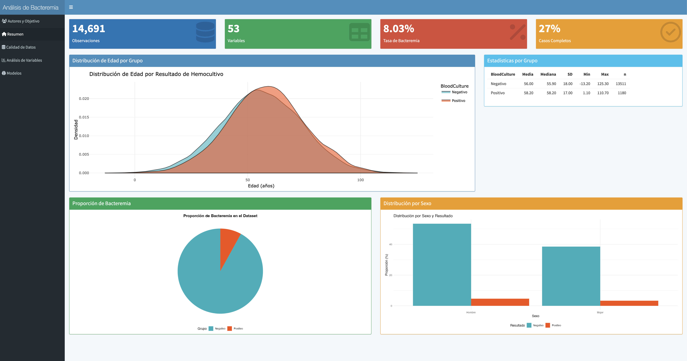
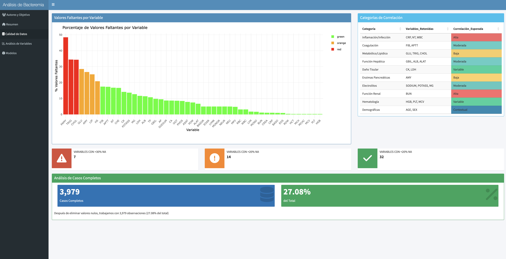
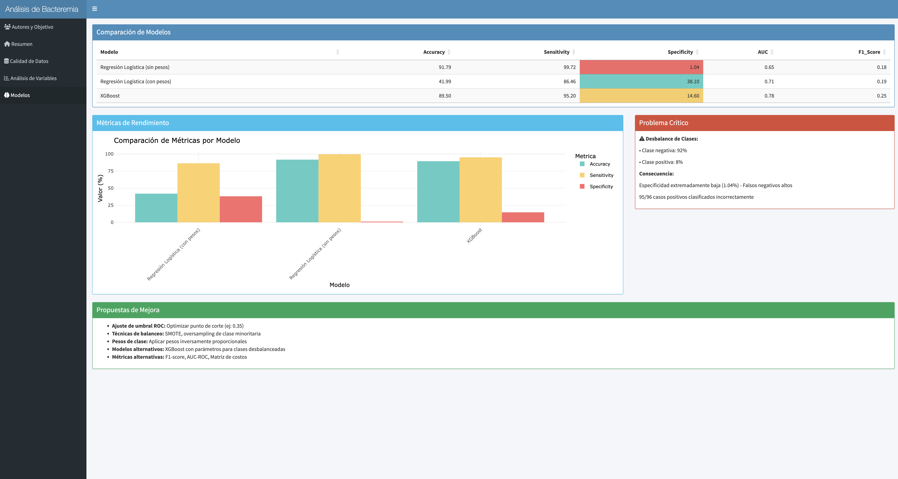

\newpage

Información del Estudiante

```{=tex}
\begin{center}
\begin{tabular}{|l|l|}
\hline
\textbf{Nombre} & Marco Russo \\
\hline
\textbf{Email} & mrussorb@uoc.edu \\
\hline
\textbf{GitHub} & https://github.com/marcusRB/uoc-ub-scientific-programming \\
\hline
\textbf{LinkedIn} & https://www.linkedin.com/in/marcusrb/ \\
\hline
\textbf{Fecha} & \today \\
\hline
\end{tabular}
\end{center}
\begin{center}
\begin{tabular}{|l|l|}
\hline
\textbf{Nombre} & Silvia Gamundi Sumando \\
\hline
\textbf{Email} & sgamundis@uoc.edu
 \\
\hline
\textbf{GitHub} & https://github.com/ \\
\hline
\textbf{LinkedIn} & https://www.linkedin.com/in/ \\
\hline
\textbf{Fecha} & \today \\
\hline
\end{tabular}
\end{center}
```

\newpage

```{r setup, include=FALSE}
knitr::opts_chunk$set(
  echo = TRUE,           # Mostrar código
  warning = FALSE,       # No mostrar warnings
  message = FALSE,       # No mostrar mensajes
  fig.align = 'center',  # Centrar figuras
  fig.width = 8,         # Ancho de figuras
  fig.height = 5,        # Alto de figuras
  out.width = '80%',     # Tamaño de salida
  cache = FALSE,         # No cachear resultados
  tidy = TRUE,           # Formatear código
  tidy.opts = list(width.cutoff = 60)
)
# 
# knitr::opts_chunk$set(
#   echo = TRUE,           # Mostrar código
#   warning = FALSE,       # No mostrar warnings
#   message = FALSE       # No mostrar mensajes

```

# Contexto y objetivo del estudio. Datos (1 punto)

El dataset elegido es `Bacteremia` del autor Heinze, G. (2023).
Bacteremia [Data set]. In PLoS One (Version S2, Vol. 9, Number 9, p.
e106765). Zenodo. <https://doi.org/10.5281/zenodo.7554815> [^1]

[^1]: Heinze, G. (2023). Bacteremia [Data set]. In PLoS One (Version S2,
    Vol. 9, Number 9, p. e106765). Zenodo.
    <https://doi.org/10.5281/zenodo.7554815>

El resto de información ha sido extracto de la fuente oficial:

> The data set consists of 14,691 observations from different patients
> with the clinical suspicion to suffer from bacteremia, for whom a a
> blood culture analysis was performed at the Vienna General Hospital,
> Austria, between January 2006 and December 2010.

> It contains the results of the blood culture analysis for bacteremia
> and the values of 51 potential predictors of bacteremia. To protect
> data privacy our version of this data was slightly modified compared
> to the original version, and this modified version was cleared by the
> Medical University of Vienna for public use (DC 2019-0054).

> The original version of the data set was used by Ratzinger et al
> (2014) to develop a model for screening bacteremic patients based on
> highly standardizable laboratory variables. This public version has
> been used by Gregorich et al (2021).

Basada en la descripción oficial del mismo, se indican que existen
14,691 observaciones de diferentes pacientes que podrían ser afectos de
`bacteriemia`. De la información disponible en Wikipedia:Bacteriemia
[\^2], la bacteriemia es la presencia de bacterias en la sangre. La
sangre es normalmente un medio estéril, por lo tanto la detección de
bacterias es indicativa de infección.

Es importante entender este punto respecto al **diagnóstico**, muchas
personas se recuperan completamente de la bacteriemia. Sin embargo, la
bacteriemia es grave y puede provocar sepsis. Cuando tiene sepsis, el
daño a los órganos principales puede ser irreversible.

Entre las **causas**, la entrada de bacterias en el torrente sanguíneo
puede ser producto de una infección localizada (ej: neumonía, absceso en
piel o mucosas), o por interrupción de la piel como barrera defensiva.
Se destacan las intervenciones quirúrgicas, utilización de dispositivos
invasivos (catéteres, sondas, asistencia mecánica respiratoria), heridas
accidentales, o quemaduras.

La infección suele empezar en los pulmones, el tracto genitourinario,
gastrointestinal o los tejidos blandos, entre ellos la piel de pacientes
con úlceras. También puede ser secundaria a una intervención dental en
pacientes de alto riesgo, especialmente en los que tienen prótesis
intravasculares.

Respecto a las **consecuencias**, dependen del tipo de bacteria y el
estado del paciente. La respuesta inmunológica a la infección puede
causar sepsis y devenir en shock séptico. También puede ocurrir que la
sangre transporte las bacterias a otros tejidos, que podrán ser
infectados. Ejemplos incluyen endocarditis, osteomielitis, y meningitis.
El tratamiento es fundamental para erradicar a las bacterias y requiere
el uso de antibióticos por vía intravenosa.

Se dispone de un pequeño diccionario que incluye el significado de cada
característica del dataset. Lo descargaremos y visualizaremos para
entender mejor el contexto de cada característica del dataset.

------------------------------------------------------------------------

# Prospección y preparación de los datos (2 puntos)

## Descripción de los datos (1 punto)

Preparamos el entorno cargando el resto de librerías que serán útiles
para realizar un análisis exploratorio de los datos.

```{r include=FALSE}
# Observamos las librerías disponibles y descargaremos el resto
if(!require('tidyverse')) install.packages('tidyverse'); library('tidyverse')
if(!require('ggplot2')) install.packages('ggplot2'); library('ggplot2')
if(!require('dplyr')) install.packages('dplyr'); library('dplyr')
if(!require('tidyr')) install.packages('tidyr');library(tidyr)

if(!require('naniar')) install.packages('naniar'); library('naniar')
if(!require('DataExplorer')) install.packages('DataExplorer'); library('DataExplorer')

if(!require('missForest')) install.packages('missForest');library(missForest)
if(!require('mice')) install.packages('mice');library(mice)
if(!require('corrplot')) install.packages('corrplot');library(corrplot)
if(!require('FactoMineR')) install.packages('FactoMineR');library(FactoMineR)
if(!require('factoextra')) install.packages('factoextra');library(factoextra)

if(!require('caret')) install.packages('caret');library(caret)
if(!require('pROC')) install.packages('pROC');library(pROC)
if(!require('randomForest')) install.packages('randomForest');library(randomForest)
if(!require('xgboost')) install.packages('xgboost');library(xgboost)
if(!require('e1071')) install.packages('e1071');library(e1071)
if(!require('caTools')) install.packages('caTools');library(caTools)

if(!require('shiny')) install.packages('shiny');library(shiny)
if(!require('shinythemes')) install.packages('shinythemes');library(shinythemes)
if(!require('pheatmap')) install.packages('pheatmap');library(pheatmap)
if(!require('RColorBrewer')) install.packages('RColorBrewer');library(RColorBrewer)
```

Descargamos el dataset en un formato dataframe y comprobaremos su
estructura.

```{r}
# Define the URL and file path
url <- "https://zenodo.org/records/7554815/files/Bacteremia_public_S2.csv?download=1"
filename <- "data/bacteremia_dataset.csv"

# Create directory if it doesn't exist
if (!dir.exists("data")) {
  dir.create("data", recursive = TRUE)
  
  # Download the file
  download.file(url, destfile = filename, mode = "wb")
} else {
  sprintf("The dataset has been downloaded and is available in 'data' path")
}

```

```{r}
# Read the CSV file
bacteremia_df <- read.csv(file = filename)
```

Finalmente mostramos los primeros datos y la naturaleza de las
características.

```{r}
# Mostramos los primeros datos con head()
head(bacteremia_df, 10)
```

```{r}
# Mostramos los últimos datos también con tail()
tail(bacteremia_df, 10)
```

Realizaremos un exploratorio genérico del dataset. Mostrando información
básica del dataset, para pasar luego a los estadísticos básicos y
comenzaremos a interactuar con las características luego.

Verificamos la estructura del juego de datos principal. Vemos el número
de columnas que tenemos y ejemplos de los contenidos de las filas.

```{r}
str(bacteremia_df)
```

```{r}
# Observamos su composición
dim(bacteremia_df)
```

Vemos que tenemos **53** características y **14691** observaciones.
Deberíamos profundizar ahora respecto al tipo de dato de cada variable y
realizar un exploratorio básico para ver inconsistencias.

```{r}
# Obtenemos el datatype de cada característica
sapply(bacteremia_df, class)
```

Respecto a las características, no tenemos transformaciones previas a
realizar, exceptuando nuevas features que podríamos crear sucesivamente.

Procederemos con un exploratorio básico extrayendo la información
estadístico de las características del dataset.

```{r}
# Mostramos los estadísticos en pantalla, los valores nulos y frecuentes
summary(bacteremia_df)
```

De las **53 características** observamos que existen:

-   2 variables del tipo numérica discretas (SEX, BloodCulture), aunque
    podríamos tratar esta última como variable dependiente.
-   50 variables son del tipo numérica continua a excepción de la
    característica id del paciente `ID`, que no es considerada para la
    modelización, peró en caso de realizar segmentación, podría ser
    útil.

Hay que tener en cuenta que la variable `AGE` ha sido modificada de
origen ligermente por lo que los estudios analíticos a continuación, no
serán del todo precisas y fiables. Por lo que propondríamos suposiciones
a lo largo del estudio.

Podemos revisar la descripción de las variables contenidas en el fichero
y si los tipos de variables se corresponden con las que hemos cargado.
Las organizamos lógicamente para darles sentido y construimos un pequeño
diccionario de datos utilizando la documentación auxiliar.

Respecto al significado de cada una de las features utilizaremos el
fichero DataDictionary -
<https://zenodo.org/records/7554815/files/bacteremia-DataDictionary.csv>
disponible en la misma página oficial para interpretar los valores.

```{r eval=FALSE, include=FALSE}
# Read directly from URL
dictionary_df <- read.csv("https://zenodo.org/records/7554815/files/bacteremia-DataDictionary.csv?download=1")

# Display as a nice formatted table
library(DT)
datatable(dictionary_df,
          options = list(pageLength = 20,
                         scrollX = TRUE,
                         searchHighlight = TRUE),
          rownames = FALSE)
```

A continuación comprobaremos los valores nulos que podrían estar en
nuestro dataset.

```{r}
# Verificación de valores perdidos
na_count <- sapply(bacteremia_df, function(x) sum(is.na(x)))
print(na_count[na_count > 0])
```

De las 14691 observaciones, disponemos de muchos valores nulos, podemos
realizar un análisis para comprobar el porcentaje que podría este
afectar a la estabilidad de los análisis.

```{r}

# Visualize missing values by variable
gg_miss_var(bacteremia_df, show_pct = TRUE) +
  labs(title = "variables faltantes en Bacteremia",
       x = "Variables",
       y = "Ratio de los valores nulos")
```

Calcularemos los valores totales y su ratio.

```{r}
missing_summary <- data.frame(
  Variable = names(bacteremia_df),
  Missing_Count = colSums(is.na(bacteremia_df)),
  Missing_Percent = round(colSums(is.na(bacteremia_df))/nrow(bacteremia_df)*100, 2)
) %>%
  arrange(desc(Missing_Percent))

print("Missing Data Summary:")
print(missing_summary)
```

Notamos que no existe características que superen al umbral del 70% de
los valores nulos, lo que podríamos considerar a eliminar la
característica de nuestros análisis.

Sin embargo, hay valores que necesitaríamos analizar a posteriori por
tener unos valores faltantes entre el 10% y 40% que supone tener que
tomar decisiones.

```{r}
filter(missing_summary, missing_summary$Missing_Percent > 20)
```

```{r}
filter(missing_summary, missing_summary$Missing_Percent > 0 & missing_summary$Missing_Percent < 20)
```

Tenemos 7 características superior al 20% de valores nulos y 42 de muy
residual, debajo del 1% hasta el 20%. Podemos realizar un análisis
exhaustivo para poder tomar decisiones al respecto, cuáles tareas de
imputaciones de los valores faltantes por segmentación de valores
cercanos (por ejemplo algún valor estadístico tipo media, mediana) o a
través de técnicas de aprendizaje automático (utilizar segmentación a
través de k-Means u otros métodos supervisado tipo kNN).

------------------------------------------------------------------------

## Preguntas “objetivo” (1 punto)

Antes de comenzar con las preguntas objetivos, obtenemos una
clasificación de los valores indicadores como rango de referencia para
el hemocultivo.

De esta manera agruparemos los valores de las features por categoría:

**A. Marcadores de inflamación e infección** (Alta correlación esperada)

| Variable | Meaning                    | Typical Range    |
|----------|----------------------------|------------------|
| CRP      | C-reactive protein         | \< 5 mg/L        |
| HS       | Hypersensitive CRP         | \< 1 mg/L        |
| NT       | Neutrophils                | 40–75 %          |
| WBC      | White blood cells          | 4–10 ×10⁹/L      |
| LDH      | Cell damage / inflammation | 140–280 U/L      |
| **PCT**  | **Procalcitonin**          | **\< 0.5 ng/mL** |

**B. Coagulación y hemostasia** (Correlación indirecta/moderada)

| Variable | Meaning                            | Typical Range    |
|----------|------------------------------------|------------------|
| FIB      | Fibrinogen                         | 200–400 mg/dL    |
| APTT     | Coagulation time                   | 25–35 s          |
| PLT      | Platelets                          | 150–400 ×10⁹/L   |
| **PT**   | **Prothrombin time**               | **11–13.5 s**    |
| **INR**  | **International normalized ratio** | **0.8–1.2**      |
| **DD**   | **D-dimer**                        | **\< 500 ng/mL** |

**C. Perfil metabólico y lipídico** (Correlación indirecta/débil)

| Variable | Meaning             | Typical Range    |
|----------|---------------------|------------------|
| GLU      | Glucose             | 70–100 mg/dL     |
| TRIG     | Triglycerides       | \< 150 mg/dL     |
| CHOL     | Cholesterol         | \< 200 mg/dL     |
| **HDL**  | **HDL cholesterol** | **\> 40 mg/dL**  |
| **LDL**  | **LDL cholesterol** | **\< 100 mg/dL** |

**D. Función hepática y proteínas** (Correlación indirecta/moderada)

| Variable | Meaning                        | Typical Range     |
|----------|--------------------------------|-------------------|
| ALB      | Albumin                        | 3.5–5.0 g/dL      |
| TP       | Total proteins                 | 6.0–8.3 g/dL      |
| CHE      | Cholinesterase                 | 5,000–12,000 U/L  |
| **TBIL** | **Total bilirubin**            | **0.1–1.2 mg/dL** |
| **DBIL** | **Direct bilirubin**           | **0–0.3 mg/dL**   |
| **AST**  | **Aspartate aminotransferase** | **10–40 U/L**     |
| **ALT**  | **Alanine aminotransferase**   | **7–56 U/L**      |
| **GGT**  | **Gamma-glutamyl transferase** | **8–61 U/L**      |
| **ALP**  | **Alkaline phosphatase**       | **30–120 U/L**    |

**E. Daño tisular/muscular** (Correlación variable)

| Variable | Meaning                    | Typical Range |
|----------|----------------------------|---------------|
| CK       | Creatine kinase            | 30–200 U/L    |
| LDH      | Cell damage                | 140–280 U/L   |
| **CKMB** | **CK-MB (cardiac marker)** | **\< 25 U/L** |

**F. Enzimas pancreáticas** (Correlación débil - contextual)

| Variable | Meaning            | Typical Range |
|----------|--------------------|---------------|
| AMY      | Amylase            | 30–110 U/L    |
| PAMY     | Pancreatic amylase | 13–53 U/L     |
| LIP      | Lipase             | \< 160 U/L    |

**G. Electrolitos y minerales** (Correlación indirecta/moderada)

| Variable | Meaning       | Typical Range      |
|----------|---------------|--------------------|
| POTASS   | Potassium     | 3.5–5.1 mmol/L     |
| MG       | Magnesium     | 1.7–2.2 mg/dL      |
| **NA**   | **Sodium**    | **136–145 mmol/L** |
| **CL**   | **Chloride**  | **98–107 mmol/L**  |
| **CA**   | **Calcium**   | **8.5–10.5 mg/dL** |
| **PHOS** | **Phosphate** | **2.5–4.5 mg/dL**  |

**H. Función renal** (Alta correlación esperada)

| Variable | Meaning                 | Typical Range     |
|----------|-------------------------|-------------------|
| **CREA** | **Creatinine**          | **0.7–1.3 mg/dL** |
| **BUN**  | **Blood urea nitrogen** | **7–20 mg/dL**    |
| **UA**   | **Uric acid**           | **3.5–7.2 mg/dL** |

**I. Hematología completa** (Correlación variable)

| Variable | Meaning                               | Typical Range       |
|----------|---------------------------------------|---------------------|
| WBC      | White blood cells                     | 4–10 ×10⁹/L         |
| **RBC**  | **Red blood cells**                   | **4.5–5.5 ×10¹²/L** |
| **HGB**  | **Hemoglobin**                        | **13–17 g/dL**      |
| **HCT**  | **Hematocrit**                        | **40–50 %**         |
| **MCV**  | **Mean corpuscular volume**           | **80–100 fL**       |
| **MCH**  | **Mean corpuscular hemoglobin**       | **27–33 pg**        |
| **MCHC** | **Mean corpuscular Hb concentration** | **32–36 g/dL**      |
| **PLT**  | Platelets                             | 150–400 ×10⁹/L      |
| **NT**   | Neutrophils                           | 40–75 %             |
| **LY**   | **Lymphocytes**                       | **20–40 %**         |
| **MONO** | **Monocytes**                         | **2–8 %**           |
| **EO**   | **Eosinophils**                       | **1–4 %**           |
| **BASO** | **Basophils**                         | **0.5–1 %**         |

**J. Variables demográficas y clínicas**

| Variable | Meaning     | Notes                 |
|----------|-------------|-----------------------|
| **Age**  | Patient age | Modificada de origen  |
| **Sex**  | Patient sex | Revisión agrupaciones |

------------------------------------------------------------------------

### ¿Existen diferencias descriptivas en los marcadores inflamatorios entre pacientes con y sin bacteriemia?

Podemos contestar a esta pregunta comparando la tendencia y dispersión
de variables según el estado del hemocultivo.

###  ¿Cómo es la distribución de las variables metabólicas y qué asimetría presentan?

Podemos describir la forma de distribución de cada feature y detectar
asimetría y valores extremos (outliers).

### ¿Cuál es la relación descriptiva entre variables fisiológicas y existen agrupaciones naturales?

Aquí podemos explorar asociaciones entre variables y detectar patrones
comunes.

###  ¿Existen diferencias descriptivas en la proporción de bacteriemia según categorías clínicas simples?

Podemos describir frecuencias y proporciones.

------------------------------------------------------------------------
\newpage
#Análisis exploratorio de los datos (2,5 puntos)

##Análisis descriptivo y gráfico (1 punto)

###Análisis descriptivo y gráfico general.

```{r}
# Guardamos una copia del dataset
bak_bacteremia <- bacteremia_df
# bacteremia_df <- bak_bacteremia
```

El primer dato que tenemos es la proporción que hay entre las dos clases
de la variable target:

```{r}
class_ratio <- prop.table(table(bacteremia_df$BloodCulture))
sprintf("La proporción de la variable dependiente es: %.2f para los valores %s y %.2f y para los valores %s.", class_ratio[1]*100, names(class_ratio)[1], class_ratio[2]*100,
        names(class_ratio)[2])
```

Vemos que la diferencia del ratio de la posible variable dependiente
está bastante desbalanceada a favor de los casos de valores negativos
que positivos, 92-8.

A partir del conjunto de datos citado, mostraremos los estadísticos
descriptivos más relevantes y comentaremos los resultados, teniendo en
cuenta el tipo de variables.

```{r}
# Estadísticos descriptivos para variables numéricas excluyendo la ID y
# la variable target y el género
num_summary <- bacteremia_df %>%
  select(-ID, -BloodCulture, -SEX) %>%
  psych::describe()

num_summary
```

Vamos a crear histogramas y describir los valores para ver los datos en
general de estos atributos para hacer una primera aproximación a los
datos:

```{r}
# Histograma de edad con densidad
library(modeest)

modeest::mfv(bacteremia_df$AGE)

ggplot(bacteremia_df, aes(x = AGE)) +
  geom_histogram(aes(y = after_stat(density)), bins = 30,
                  fill = "skyblue", color = "black") +
geom_density(color = "red", size = 1.5) +
geom_vline(xintercept = mean(bacteremia_df$AGE),
          color = "blue", linetype = "dashed", size = 1) +
geom_vline(xintercept = median(bacteremia_df$AGE),
          color = "darkgreen", linetype = "dashed", size = 1) +
geom_vline(xintercept = modeest::mfv(bacteremia_df$AGE),
          color = "purple", linetype = "dashed", size = 1) +
labs(title = "Distribución de Edad",
subtitle = paste("Media =", round(mean(bacteremia_df$AGE), 1), "años",
                 "\nMediana =", round(median(bacteremia_df$AGE), 1), "años",
                  "\nModa =", round(modeest::mfv(bacteremia_df$AGE), 1), "años"),
x = "Edad (años)",
y = "Densidad"
) +
theme_minimal() +
theme(plot.title = element_text(hjust = 0.5, face = "bold"))
```

Podemos detectar que la media está situada en 56.2 años con una mediana
situada en 58. Pero los valores frecuentes está por los 66 años.

Realizaremos ahora un estudio por edad respecto a la variable
dependiente

```{r}
# Extraeremos los estadísticos por edad
bacteremia_df %>%
  group_by(BloodCulture) %>%
  summarise(
    count = n(),
    mean_age = mean(AGE, na.rm = TRUE),
    median_age = median(AGE, na.rm = TRUE),
    sd_age = sd(AGE, na.rm = TRUE),
    min_age = min(AGE, na.rm = TRUE),
    max_age = max(AGE, na.rm = TRUE)
  )
```

Graficaremos los casos negativos a la prueba realizada de BloodCulture,
donde la media de la edad es 55, con un mínimo de 16 y máximo 101. Los
casos positivos, que vimos anteriormente son un 8%, la media es 62 con
un mínimo de 17 y la máxima edad 99. Aunque los datos podrían ser
manipulados a origen, intentamos observar una cierta coherencia entre
los dos casos. A conitnuación graficaremos con un boxplot.

```{r}
# Box plot: Edad por estado del hemocultivo
ggplot(bacteremia_df, aes(x = factor(BloodCulture, labels = c("Negativo", "Positivo")),
y = AGE, fill = factor(BloodCulture))) +
geom_boxplot(alpha = 0.7) +
scale_fill_manual(values = c("#2ecc71", "#e74c3c")) +
labs(
title = "Distribución de Edad según el hemocultivo",
x = "Estado del hemocultivo ",
y = "Edad (años)"
) +
theme_minimal() +
theme(
plot.title = element_text(hjust = 0.5, face = "bold"),
legend.position = "none"
)
```

### Análisis descriptivo y gráfico: estudio de correlaciones:

Crearemos una nueva variable binaria para usarla en análisis posteriores:
```{r}
# Seleccionaremos los valores True y False
bacteremia_df$BloodCulture_bin <- ifelse(bacteremia_df$BloodCulture == "yes", 1, 0)
```


Mostramos gráficamente las correlaciones entre las
variables de nuestro dataset:

```{r}
cor_data <- bacteremia_df %>%
select(-ID, -BloodCulture, -BloodCulture_bin) %>%
drop_na()
# Creamos una matriz de correlación
cor_matrix <- cor(cor_data)

# Mostramos gráficamente
corrplot(
  cor_matrix,
  method = "color",
  type = "upper",
  tl.srt = 45,
  tl.cex = 0.7,
  number.cex = 0.6
)

```

Al tener 53 variables, vamos a realizar un análisis de correlaciones
separando las variables por las categorías anteriormente definidas (mapa
de calor con escala azul-rojo). En este mapa, nos fijaremos en las
variables intra categoría que estén áltamente correlacionadas. Después,
se obtendrán otros mapas de calor (verde-morado) que mostrarán las
correlaciones finales tras descartar las variables identificadas en el
mapa previo. Finalmente, con las variables seleccionadas por categoría,
realizaremos otro análisis de correlaciones para observar posibles
relaciones considerando todas las ellas.

Nota: como criterio, se han eliminado las variables que presentaban una
correlación media-alta, siendo el corte de 0.3 en valor absoluto. A
pesar de que este corte puede ser considerado bajo, se ha decidido usar
ya que debido al amplio número de variables, se dificultaba su
viasulización e interpretación.

**1. Variables del tipo Complete Blood Count (CBC) - Hematology**

```{r}

# Correlación variables del tipo Complete Blood Count (CBC) - Hematology
vars_big <- c("WBC", "RBC", "HGB", "HCT", "PLT", "MCV", "MCH", "MCHC", 
                 "RDW", "MPV", "PDW"
              )

cor_big <- cor(
  bacteremia_df[, vars_big],
  use = "complete.obs"
)

corrplot(
  cor_big,
  method = "color",
  type = "upper",
  col = colorRampPalette(c("blue", "white", "red"))(200),
  addCoef.col = "black",
  number.cex = 0.8,     # correlation numbers
  tl.col = "black",
  tl.cex = 0.7,         # SMALLER labels
  tl.srt = 45,          # ROTATED labels (45 degrees)
  cl.cex = 1.0,
  title = "Matriz de correlación",
  mar = c(0, 0, 3, 0)
)

```

-   RBC y HCT: correlación muy elevada con la Hemoglobina, 0.90 y 0.98
    respectivamente y 0.92 entre HCT u RBC.

-   

-   MCH y PDW: MCH está muy ligada a MCV (0.87) y PDW a MPV (0.93).

-   MVP: correlacionada a un nivel medio con PLT.

-   RDW: correlacionada a un nivel medio (en torno al -0.34 y -0.45).

-   MCHC: correlacionada a un nivel medio con MCH de 0.52

Correlacion tras no considerar las variables:

```{r}
# Correlación variables del tipo Complete Blood Count (CBC) - Hematology
vars_big <- c("WBC", "HGB", "PLT", "MCV"
              )

cor_big <- cor(
  bacteremia_df[, vars_big],
  use = "complete.obs"
)

corrplot(
  cor_big,
  method = "color",
  type = "upper",
  col = colorRampPalette(c("green", "white", "purple"))(200),
  addCoef.col = "black",
  number.cex = 0.8,     # correlation numbers
  tl.col = "black",
  tl.cex = 0.7,         # SMALLER labels
  tl.srt = 45,          # ROTATED labels (45 degrees)
  cl.cex = 1.0,
  title = "Matriz de correlación",
  mar = c(0, 0, 3, 0)
)
```

**2. Variables del tipo White Blood Cell Differential**

```{r}

# Correlación variables del tipo White Blood Cell Differential
vars_big <- c("NEU", "NEUR", "LYM", "LYMR", "MONO", "MONOR", 
              "EOS", "EOSR", "BASO", "BASOR", "NT"
              )

cor_big <- cor(
  bacteremia_df[, vars_big],
  use = "complete.obs"
)

corrplot(
  cor_big,
  method = "color",
  type = "upper",
  col = colorRampPalette(c("blue", "white", "red"))(200),
  addCoef.col = "black",
  number.cex = 0.8,     # correlation numbers
  tl.col = "black",
  tl.cex = 0.7,         # SMALLER labels
  tl.srt = 45,          # ROTATED labels (45 degrees)
  cl.cex = 1.0,
  title = "Matriz de correlación",
  mar = c(0, 0, 3, 0)
)

```

De froma análoga al caso anterior, descartamos las variables que están a
un nivel alto medio de correlación.

-   Variables correlacionadas a un nivel medio-alto: NEUR, LYMR, EOSR,
    BASOR, MONOR y MONO

Correlacion tras no considerar las variables:

```{r}
# Correlación variables del tipo White Blood Cell Differential
vars_big <- c("NEU", "LYM", "EOS",  "BASO",  "NT"
              )

cor_big <- cor(
  bacteremia_df[, vars_big],
  use = "complete.obs"
)

corrplot(
  cor_big,
  method = "color",
  type = "upper",
  col = colorRampPalette(c("green", "white", "purple"))(200),
  addCoef.col = "black",
  number.cex = 0.8,     # correlation numbers
  tl.col = "black",
  tl.cex = 0.7,         # SMALLER labels
  tl.srt = 45,          # ROTATED labels (45 degrees)
  cl.cex = 1.0,
  title = "Matriz de correlación",
  mar = c(0, 0, 3, 0)
)

```

**3. Variables del tipo Coagulation**

```{r}

# Correlación variables del tipo Coagulation
vars_big <- c("APTT", "FIB"
              )

cor_big <- cor(
  bacteremia_df[, vars_big],
  use = "complete.obs"
)

corrplot(
  cor_big,
  method = "color",
  type = "upper",
  col = colorRampPalette(c("blue", "white", "red"))(200),
  addCoef.col = "black",
  number.cex = 0.8,     # correlation numbers
  tl.col = "black",
  tl.cex = 0.7,         # SMALLER labels
  tl.srt = 45,          # ROTATED labels (45 degrees)
  cl.cex = 1.0,
  title = "Matriz de correlación",
  mar = c(0, 0, 3, 0)
)

```

Consideraremos ambas variables ya que a penas están correlacionadas
entre sí.

**4. Variables del tipo Electrolytes & Minerals**

```{r}

# Correlación variables del tipo Electrolytes & Minerals
vars_big <- c("SODIUM", "POTASS", "CA", "PHOS", "MG"
              )

cor_big <- cor(
  bacteremia_df[, vars_big],
  use = "complete.obs"
)

corrplot(
  cor_big,
  method = "color",
  type = "upper",
  col = colorRampPalette(c("blue", "white", "red"))(200),
  addCoef.col = "black",
  number.cex = 0.8,     # correlation numbers
  tl.col = "black",
  tl.cex = 0.7,         # SMALLER labels
  tl.srt = 45,          # ROTATED labels (45 degrees)
  cl.cex = 1.0,
  title = "Matriz de correlación",
  mar = c(0, 0, 3, 0)
)

```

-   Variables descartadas: PHOS.

Correlacion tras descartar las variables:

```{r}
# Correlación variables del tipo Electrolytes & Minerals
vars_big <- c("SODIUM", "POTASS", "CA", "MG"
              )

cor_big <- cor(
  bacteremia_df[, vars_big],
  use = "complete.obs"
)

corrplot(
  cor_big,
  method = "color",
  type = "upper",
  col = colorRampPalette(c("green", "white", "purple"))(200),
  addCoef.col = "black",
  number.cex = 0.8,     # correlation numbers
  tl.col = "black",
  tl.cex = 0.7,         # SMALLER labels
  tl.srt = 45,          # ROTATED labels (45 degrees)
  cl.cex = 1.0,
  title = "Matriz de correlación",
  mar = c(0, 0, 3, 0)
)
```

**5. Variables del tipo Kidney Function**

```{r}

# Correlación variables del tipo  Kidney Function
vars_big <- c("CREA", "BUN"
              )

cor_big <- cor(
  bacteremia_df[, vars_big],
  use = "complete.obs"
)

corrplot(
  cor_big,
  method = "color",
  type = "upper",
  col = colorRampPalette(c("blue", "white", "red"))(200),
  addCoef.col = "black",
  number.cex = 0.8,     # correlation numbers
  tl.col = "black",
  tl.cex = 0.7,         # SMALLER labels
  tl.srt = 45,          # ROTATED labels (45 degrees)
  cl.cex = 1.0,
  title = "Matriz de correlación",
  mar = c(0, 0, 3, 0)
)

```

-   Variables descartadas: CREA.

**6. Variables del tipo Liver Function**

```{r}

# Correlación variables del tipo   Liver Function
vars_big <- c("GBIL", "TP", "ALB", "AP", "ASAT", "ALAT", "GGT", "CHE"
              )

cor_big <- cor(
  bacteremia_df[, vars_big],
  use = "complete.obs"
)

corrplot(
  cor_big,
  method = "color",
  type = "upper",
  col = colorRampPalette(c("blue", "white", "red"))(200),
  addCoef.col = "black",
  number.cex = 0.8,     # correlation numbers
  tl.col = "black",
  tl.cex = 0.7,         # SMALLER labels
  tl.srt = 45,          # ROTATED labels (45 degrees)
  cl.cex = 1.0,
  title = "Matriz de correlación",
  mar = c(0, 0, 3, 0)
)

```

-   Variables descartadas: TP, ASAT, CHE, GGT y AP

Correlacion tras descartar las variables:

```{r}
# Correlación variables del tipo   Liver Function
vars_big <- c("GBIL", "ALB", "ALAT"
              )

cor_big <- cor(
  bacteremia_df[, vars_big],
  use = "complete.obs"
)

corrplot(
  cor_big,
  method = "color",
  type = "upper",
  col = colorRampPalette(c("green", "white", "purple"))(200),
  addCoef.col = "black",
  number.cex = 0.8,     # correlation numbers
  tl.col = "black",
  tl.cex = 0.7,         # SMALLER labels
  tl.srt = 45,          # ROTATED labels (45 degrees)
  cl.cex = 1.0,
  title = "Matriz de correlación",
  mar = c(0, 0, 3, 0)
)
```

**7. Variables del tipo Cardiac & Metabolic**

```{r}

# Correlación variables del tipo Cardiac & Metabolic
vars_big <- c("HS", "LDH", "CK", "GLU", "TRIG", "CHOL"
              )

cor_big <- cor(
  bacteremia_df[, vars_big],
  use = "complete.obs"
)

corrplot(
  cor_big,
  method = "color",
  type = "upper",
  col = colorRampPalette(c("blue", "white", "red"))(200),
  addCoef.col = "black",
  number.cex = 0.8,     # correlation numbers
  tl.col = "black",
  tl.cex = 0.7,         # SMALLER labels
  tl.srt = 45,          # ROTATED labels (45 degrees)
  cl.cex = 1.0,
  title = "Matriz de correlación",
  mar = c(0, 0, 3, 0)
)

```

No descartamos variables al no estar a penas correlacionadas entre sí.

**8. Variables del tipo Pancreatic Enzymes**

```{r}

# Correlación variables del tipo Cardiac & Metabolic
vars_big <- c("AMY", "PAMY", "LIP"
              )

cor_big <- cor(
  bacteremia_df[, vars_big],
  use = "complete.obs"
)

corrplot(
  cor_big,
  method = "color",
  type = "upper",
  col = colorRampPalette(c("blue", "white", "red"))(200),
  addCoef.col = "black",
  number.cex = 0.8,     # correlation numbers
  tl.col = "black",
  tl.cex = 0.7,         # SMALLER labels
  tl.srt = 45,          # ROTATED labels (45 degrees)
  cl.cex = 1.0,
  title = "Matriz de correlación",
  mar = c(0, 0, 3, 0)
)

```

-   Variables descartadas: LIP y PAMY.

**9. Variables del tipo Inflammatory Markers**

No la eliminamos al ser la única de su categoría.

**10. Correlación entre categorías.**

A continuación procedemos a estudiar las correlaciones con las variables
restantes que no hemos descartado:

```{r}
# Correlación todas
vars_big <- c("WBC", "HGB", "PLT", "MCV", "NEU", "LYM",  "EOS",  "BASO",
              "NT", "SODIUM", "POTASS", "CA", "MG", "BUN", "GBIL", "ALB",
              "ALAT", "AMY", "CRP"
              )

cor_big <- cor(
  bacteremia_df[, vars_big],
  use = "complete.obs"
)

corrplot(
  cor_big,
  method = "color",
  type = "upper",
  col = colorRampPalette(c("blue", "white", "red"))(200),
  addCoef.col = "black",
  number.cex = 0.8,     # correlation numbers
  tl.col = "black",
  tl.cex = 0.7,         # SMALLER labels
  tl.srt = 45,          # ROTATED labels (45 degrees)
  cl.cex = 1.0,
  title = "Matriz de correlación",
  mar = c(0, 0, 3, 0)
)
```

-   Variables descartadas: WCB, NEU, CA y ALB

```{r}

# Correlación todas
vars_big <- c("HGB", "PLT", "MCV", "LYM",  "EOS",  "BASO",
              "NT", "SODIUM", "POTASS", "MG", "BUN", "GBIL", 
              "ALAT", "AMY", "CRP"
              )

cor_big <- cor(
  bacteremia_df[, vars_big],
  use = "complete.obs"
)

corrplot(
  cor_big,
  method = "color",
  type = "upper",
  col = colorRampPalette(c("green", "white", "purple"))(200),
  addCoef.col = "black",
  number.cex = 0.8,     # correlation numbers
  tl.col = "black",
  tl.cex = 0.7,         # SMALLER labels
  tl.srt = 45,          # ROTATED labels (45 degrees)
  cl.cex = 1.0,
  title = "Matriz de correlación",
  mar = c(0, 0, 3, 0)
)
```

Observamos que tras el análisis de correlaciones se ha reducido
considerablemente el número de variables, de 53 a 16, quedándonos
únicamente con aquellas que presentan muy poca relación entre sí.

Este análisis exhausitivo de correlaciones es un paso previo necesario
para poder realizar la sección 4 de modelos de aprendizaje automático,
lo cual se desarrollará en dicha sección.

### Limpieza de los datos.

```{r}

feature_categories <- list(
  
  # Complete Blood Count (CBC) - Hematology
  hematology = c("WBC", "RBC", "HGB", "HCT", "PLT", "MCV", "MCH", "MCHC", 
                 "RDW", "MPV", "PDW"),
  
  # White Blood Cell Differential
  wbc_differential = c("NEU", "NEUR", "LYM", "LYMR", "MONO", "MONOR", 
                       "EOS", "EOSR", "BASO", "BASOR", "NT"),
  
  # Coagulation
  coagulation = c("APTT", "FIB"),
  
  # Electrolytes & Minerals
  electrolytes = c("SODIUM", "POTASS", "CA", "PHOS", "MG"),
  
  # Kidney Function
  kidney = c("CREA", "BUN"),
  
  # Liver Function
  liver = c("GBIL", "TP", "ALB", "AP", "ASAT", "ALAT", "GGT", "CHE"),
  
  # Cardiac & Metabolic
  cardiac_metabolic = c("HS", "LDH", "CK", "GLU", "TRIG", "CHOL"),
  
  # Pancreatic Enzymes
  pancreatic = c("AMY", "PAMY", "LIP"),
  
  # Inflammatory Markers
  inflammatory = c("CRP")
)

# Create category labels for each feature
feature_info <- data.frame(
  Variable = names(bacteremia_df),
  category = NA,
  stringsAsFactors = FALSE
)

for (cat_name in names(feature_categories)) {
  vars_in_cat <- feature_categories[[cat_name]]
  feature_info$category[feature_info$Variable %in% vars_in_cat] <- cat_name
}

# Combine with missing data info
feature_analysis <- missing_summary %>%
  left_join(feature_info, by = "Variable") %>%
  arrange(category, desc(Missing_Percent))

print(feature_analysis)
```

#### El algoritmo MICE

La imputación múltiple mediante ecuaciones encadenadas es un método
robusto e informativo para gestionar la falta de datos en conjuntos de
datos. Este procedimiento rellena (imputa) los datos faltantes en un
conjunto de datos mediante una serie iterativa de modelos predictivos.
En cada iteración, cada variable especificada en el conjunto de datos se
imputa utilizando las demás variables. Estas iteraciones deben
ejecutarse hasta que se observe que se ha alcanzado la convergencia.

**Fuga de datos**:

MICE es especialmente útil si los valores faltantes están asociados con
la variable objetivo de una forma que introduce fugas. Por ejemplo,
supongamos que se desea modelar la retención de clientes en el momento
del registro. Una variable se recopila en el momento del registro o un
mes después. La ausencia de esa variable constituye una fuga de datos,
ya que indica que el cliente no se retuvo durante un mes.

**Análisis del embudo**:

La información suele recopilarse en diferentes etapas de un embudo. MICE
puede utilizarse para realizar estimaciones fundamentadas sobre las
características de las entidades en diferentes puntos de un embudo.

**Intervalos de confianza**:

MICE puede utilizarse para imputar valores faltantes; sin embargo, es
importante tener en cuenta que estos valores imputados constituyen una
predicción. Crear múltiples conjuntos de datos con diferentes valores
imputados permite realizar dos tipos de inferencia:

-   Distribución de valores imputados: Se puede crear un perfil para
    cada valor imputado, lo que permite realizar afirmaciones sobre la
    distribución probable de dicho valor.

-   Distribución de predicción del modelo: Con múltiples conjuntos de
    datos, se pueden crear múltiples modelos y una distribución de
    predicciones para cada muestra. Las muestras con valores imputados
    que no pudieron imputarse con mucha confianza presentarían una mayor
    varianza en sus predicciones.

Hacemos una copia del dataset y probamos solamente dos métodos.

```{r}
bak_bacteremia_df <- bacteremia_df
```

El primer método es performar con MICE, tal y como explicado, sin embargo
este método podría tardar muchas horas en ejecutarse.

Para ello comprobaremos más adelante el método de extracción de las características
importantes o utilizaremos el método de reducción de dimensionalidad en
SVD o PCA para poder extraer solamente las imporantes para realizar la 
imputación.

```{r}
# Multiple imputation using MICE
# cat("\nPerforming Multiple Imputation...\n")
# imputed_data <- mice(bacteremia_df, 
#                      m = 5, 
#                      maxit = 50, 
#                      method = 'pmm', 
#                      seed = 42)
# 
# # Extract first imputed dataset
# bacteremia_mice_imputed <- complete(imputed_data, 1)
# 
# # Check imputation quality
# cat("\nMissing values after imputation:", sum(is.na(bacteremia_mice_imputed)), "\n")
```

------------------------------------------------------------------------

\newpage

## Ejercicios de inferencia y simulación (1,5 puntos)

### Basándoos en los conceptos trabajados en el LAB3, definid una función en R que realice algún tipo de cálculo de interés en el contexto del conjunto de datos.

Como hemos mencionado al inico, si la bacteremia es grave, puede
provocar sepsis. En el contexto de la sepsis, la trombocitopenia
(plaquetas bajas) y la anemia severa actúan como indicadores precoces de
fallo orgánico y fragilidad hematológica. Debido a la importancia de
estos dos marcadores en este contexto y al disponer de ellos en el
conjunto de datos (variables HGB y PLT), se ha desarrollado la función
*evaluar_riesgo*. Esta función permite identificar el riesgo de un
paciente de sufrir anemia y trombocitopenia en función de los valores de
estos indicadores:

```{r}
evaluar_riesgo <- function(hgb, plt) {
  if(!is.numeric(hgb) | !is.numeric(plt)) {
    return("Error: Los parámetros deben ser numéricos")
  }
  if(hgb < 8 & plt < 100) {
    resultado <- "Riesgo Crítico: Anemia y Trombocitopenia severas"
  } 
  else if(hgb < 8) {
    resultado <- "Riesgo Crítico: Anemia severa detectada"
  } 
  else if(plt < 100) {
    resultado <- "Riesgo Crítico: Trombocitopenia severa detectada"
  } 
  else if (hgb < 10 | plt < 150) {
    resultado <- "Riesgo Moderado: Monitorizar valores hematológicos"
  } 
  else {
    resultado <- "Valores dentro de la normalidad"
  }
  return(resultado)
}
```

Para probar la consistencia de la función vamos a buscar en nuestro
conjunto de datos valores de estos indicadores para cada uno de los
casos contemplados:

```{r}
fila_normal <- filter(bacteremia_df, HGB > 8 & PLT > 100)[1, c("HGB", "PLT")]
fila_mod <- filter(bacteremia_df, 
              (HGB < 10 | PLT < 150)& HGB > 8 & PLT > 100)[1, c("HGB", "PLT")]
fila_anemia <- filter(bacteremia_df, HGB < 8 & PLT > 100)[1, c("HGB", "PLT")]
fila_tromb <- filter(bacteremia_df, HGB > 8 & PLT < 100)[1, c("HGB", "PLT")]
fila_ambos <- filter(bacteremia_df, HGB < 8 & PLT < 100)[1, c("HGB", "PLT")]

casos_criticos <- rbind(fila_normal,fila_mod,fila_anemia,fila_tromb,fila_ambos)
casos_criticos$Condicion_Riesgo <- mapply(evaluar_riesgo, 
                                          casos_criticos$HGB,
                                          casos_criticos$PLT)

print(casos_criticos)
```

Vemos si funciona el control de formato de valores de entrada:

```{r}
evaluar_riesgo("12.7", 90)
```

```{r}
evaluar_riesgo(12.7, 90)
```


Los umbrales de riesgo se han definido siguiendo los criterios de la OMS
para la anemia grave (Hb \< 8 g/dL) y los criterios SOFA para la
evaluación del fallo orgánico en procesos infecciosos (Plaquetas \< 100
G/L). Tambien, destacamos que aunque en el diccionario del dataset para
la hemoglobina diga G/L, hemos visto en la sección de análisis
exploratorio que los valores de la hemoglobina varían en un rango de 3 y
21 corresponden a g/dL.

### Basándoos en los conceptos del LAB4 y la PEC2, plantead un mínimo de tres enunciados que respondan a una cuestión de probabilidad.

Para formular los enunciados de las siguientes cuestiones, primero
vamos a obtener valores reales de nuestro conjunto de datos.

-   Prevalencia de bacteriemia:

```{r}
class_ratio <- prop.table(table(bacteremia_df$BloodCulture))
class_ratio
```

La prevalencia de bacteramia es 8%.

-   Proporción de hombres(1) y mujeres(2):

```{r}
prop_sex <- prop.table(table(bacteremia_df$SEX))
prop_sex
```

-   Proporciones de bacteramia en función del sexo:

```{r}
sex_bact <- prop.table(table(bacteremia_df$BloodCulture, bacteremia_df$SEX))
sex_bact
```

-   Proporción MCV alto (mide el tamaño promedio de los glóbulos rojos):

```{r}
df_MVC_alto<- filter(bacteremia_df, MCV>100)
proporcion <- nrow(df_MVC_alto)/nrow(bacteremia_df)
proporcion
```

-   Proporciones de bacteramia de los pacientes con MVC alto:

```{r}
class_mvc <- prop.table(table(df_MVC_alto$BloodCulture))
class_mvc
```

> 1. El 3.85% de los pacientes tienen un un volumen corpuscular medio (MCV)
> alto (\>100). Si el 11.48% de los pacientes con MCV alto tienen
> bacteriemia ¿cuál es la probabilidad de que un paciente elegido al
> azar tenga ambos criterios?

Al tener:

-   $P(MVC>100)=0.03852699$

-   $P(Bacteriemia|MVC>100)= 0.114841$

Aplicando la fórmula de la probabilidad condicionada obtenemos la
probabilidad de la intersección de ambos sucesos:

\$P(Bacteriemia \cap MVC\>100)= P(Bacteriemia\|MVC\>100) \cdot
P(MVC\>100) = 0.004424478 \$

```{r}
proporcion*class_mvc["yes"]
```

Por tanto la probabilidad de tener volumen corpuscular medio alto y
bacteriemia es del 0.44%.

> 2.  Si la prevalencia de bacteriemia en el conjunto de pacientes es
>     del 8,03% , si seleccionamos a 50 de ellos al azar, ¿cuál es la
>     probabilidad de que al menos 5 tengan un cultivo positivo?

Al disponer de:

-   n = 50 pacientes.

-   p = 0.0803 probabilidad de tener bacteriemia (Éxito).

-   k = 5 (al menos 5 éxitos).

Nos piden calcular $P(X\geq5)$ siendo X una variable aleatoria
X\~Bin(n=250,p=0.0803).

```{r}
 pbinom(4, 20, class_ratio["yes"],lower.tail = FALSE)
```

La probabilidad de que al menos 5 de esos 50 pacientes tengan
bacteriemia es del 1.86%.

> 3.  Sabemos que el 41.89% de los pacientes son mujeres y el 58.10% son
>     hombres. Si la bacteriemia afecta al 4.68% de los hombres y al
>     3.36% de las mujeres, si seleccionamos un paciente con cultivo
>     positivo, ¿cuál es la probabilidad de que sea mujer?

-   $P(Hombre)=0.581036$

-   $P(Mujer)=0.418964$

-   $P(bacteriemia|Hombre)= 0.04676332$

-   $P(bacteriemia|Mujer)= 0.03355796$

Como nos están pidiendo $P(Mujer|bacteriemia)$, por tanto aplicamos el
teorema de Bayes:

$P(Mujer|bacteriemia) = \frac{P(bacteriemia|Mujer) \cdot P(Mujer)}{P(bacteriemia)}=0.3409973$

Empelamos el teorema de la probabilidad total para calcular
$P(bacteriemia)$:

$P(bacteriemia)=P(bacteriemia|Hombre) \cdot P(Hombre) + P(bacteriemia|Mujer) \cdot P(Mujer)=0.04123075$

```{r}
ph <- prop_sex[1]
pm <- prop_sex[2]
phb <- sex_bact[2]
phm <- sex_bact[4]
pbact <- ph*phb+pm*phm
cat("Probabilidad de tener bacteriemia:",pbact)
```

Finalmnete, tenemos que:

```{r}
p_mujer_bact <- (pm*phm)/(pbact)
cat("Probabilidad de si un paciente tiene la enfermedad que sea mujer:",p_mujer_bact)
```

> 4.  Un test rápido tiene una sensibilidad del 90% y la prevalencia es
>     del 8.03%. ¿Cuál es la probabilidad de que un paciente esté
>     realmente infectado si el test da positivo? (Asumiendo una
>     especificidad del 95%).

Nota: los valores de la prevalencia y sensibilidad son inventados.

-   $P(Infectado)=0.0803$

-   $P(Sano)=1-0.0803=0.9197$

-   Sensibilidad: $P(Positivo∣Infectado)=0.90$

-   Especificidad:
    $P(Negativo∣Sano)=0.95 \Rightarrow P(Positivo∣Sano)=0.05$

Por tanto:

$P(Infectado∣Positivo)= \frac{P(Positivo∣Infectado)\cdot P(Infectado)}{P(Positivo)}=$

```{r}
prev <- class_ratio["yes"]
sano <- 1-prev
sens <- 0.90
espf <- 0.95
fp <- 1-espf
prob <- (prev*sens)/(prev*sens+sano*fp)
cat("La probabilidad de estar infectado si el test da positivo es", prob)
```

### Incluid un mínimo de un enunciado que corresponda a un breve modelo de simulación. Si vuestro conjunto de datos no facilita este tipo de enunciados, podéis generar una o varias distribuciones basándoos en parámetros determinados definidos por vosotros, afines al contexto del estudio.

> Se observa que los niveles de hemoglobina (HGB) en pacientes con
> sospecha de bacteriemia siguen una distribución aproximadamente
> normal, una característica común en variables biológicas de grandes
> poblaciones. A partir de la media y la desviación típica obtenidas de
> nuestro conjunto de datos real, realizar una simulación de 10.000
> casos utilizando una distribución normal. Estimar mediante simulacion
> la probabilidad de que un paciente presente un nivel de hemoglobina
> inferior a 10 g/dL (umbral de riesgo moderado/anemia) y comparar este
> resultado con la frecuencia observada en el dataset original para
> validar la precisión del modelo simulado.

En primer lugar, calculamos la media y la desviación típica de la
variable HGB de nuestro dataset original:

```{r}
media_hgb <- mean(bacteremia_df$HGB, na.rm = TRUE)
sd_hgb <- sd(bacteremia_df$HGB, na.rm = TRUE)

cat("Media:", media_hgb, "\n")
cat("Desviación Típica:", sd_hgb, "\n")
```

Para verificar que esta variable sigue una distribución normal,
graficamos su densidad frente a la curva de una normal con media y
desviación típica ya calculadas de nuestra variable HGB:

```{r}
library(ggplot2)

ggplot(bacteremia_df, aes(x = HGB)) +
  geom_density(fill = "cyan1", alpha = 0.5) +
  stat_function(fun = dnorm, 
                args = list(mean = media_hgb, sd = sd_hgb), 
                color = "slateblue1", size = 1) +
  labs(title = "Densidad Real de HGB vs. Curva Normal Teórica",
       subtitle = paste("Media =", round(media_hgb, 2), "| SD =", round(sd_hgb, 2)),
       x = "Hemoglobina (g/dL)", y = "Densidad") +
  theme_minimal()
```

Efectivamente observamos que podemos asumir que la variable HGB se
distribuye como una normal.

A continuación, simulamos una muestra de n=10.000 de una normal con
media 11.56801 y desviación típica 2.250767. Mostramos gráficamente el
resultado comparando la distribución de los valores reales frente a los
obtenidos mediante simulación:

```{r}
set.seed(123)
hgb_simulada <- rnorm(n = 10000, mean = media_hgb, sd = sd_hgb)
df_simulacion <- data.frame(HGB = hgb_simulada)

ggplot() +
  #Datos originales
  geom_density(data = bacteremia_df, aes(x = HGB, fill = "Real"), alpha = 0.4) +
  #Datos simulados
  geom_density(data = df_simulacion, aes(x = HGB, color = "Simulado"), size = 1, linetype = "dashed") +

  scale_fill_manual(name = "Origen", values = c("Real" = "darkolivegreen1")) +
  scale_color_manual(name = "Modelo", values = c("Simulado" = "purple")) +
  
  labs(title = "Validación del Modelo de Simulación (n=10.000)",
       subtitle = paste("Comparación de la Hemoglobina Real vs Distribución Normal (μ =", 
                        round(media_hgb, 2), ", σ =", round(sd_hgb, 2), ")"),
       x = "Hemoglobina (g/dL)", 
       y = "Densidad") +
  theme_minimal()
```

Podemos observar que salvo ligeras diferencias en la parte lateral
izquierda y superior de la gráfica, los datos simulados se asemejan
considerablemente a los valores reales.

Finalmente, calculamos la probabilidad de que un paciente presente un
nivel de hemoglobina inferior a 10 g/dL tanto con nuestros datos reales
como con los obtenidos mediante simulación:

```{r}
prob_real <- sum(bacteremia_df$HGB < 10, na.rm = TRUE) / nrow(bacteremia_df)
prob_simulada <- sum(df_simulacion$HGB < 10) / 10000

cat("Frecuencia Real (HGB < 10):", round(prob_real, 4), "\n")
cat("Probabilidad Simulada (HGB < 10):", round(prob_simulada, 4), "\n")
```

Vemos que la diferencia entre el valor real y el valor simulado es de
0.02. Al ratarse de una diferencia mínima, podemos concluir que
resultados obtenidos mediante simulación confirman la normalidad de la
hemoglobina en este escenario.

------------------------------------------------------------------------

\newpage

# Modelos de aprendizaje automático (2,5 puntos)

**Resumen**

Esta sección la dividiremos en dos secciones en las que se ha procedido
de manera diferente.

1.  Primer escenario:

-   Se considerará el conjunto de datos eliminando las observaciones que
    contengan valores nulos.

-   Las variables que se emplearán para entrenar los modelos han sido
    las seleccionadas tras el análisis de correlaciones de la sección
    3.3.2.

-   En esta sección hemos entrenado los modelos de Regresión logística,
    SMV y XGBoost para posteriormente comparar los resultados obtenidos.

2.  Segundo escenario.

-   Se considerará el conjunto de datos con todas las observacines.

-   Se realizara un estudio de las características más relevantes a
    traves de un análisis de componentes principales (PCA) y extracción
    de features importance a traveés de randomforest.
    
-   Una vez extraídas, se imputarán los valores nulos.

-   En esta sección hemos entrenado el modelo de Regresión logística
    para posteriormente comparar los resultados obtenidos obtenidos en
    el primer escenario.

Finalmente, analizaremos los resultados obtenidos en ambos escenarios y
extraeremos una conclusión final en la sección 6.

**Consideraciones generales**

Para ambos escenarios, debido a la naturaleza de la variable binaria
`BloodCulture` hemos considerado adecuado un modelo de regresión
logística.

A diferencia de la regresión lineal, este modelo no requiere normalidad
ni homocedasticidad, pero para garantizar su validez en la predicción de
bacteriemia se han verificado las siguientes condiciones fundamentales:

-   **Respuesta binaria**: como ya hemos mencionado, la variable
    dependiente utilizada es BloodCulture_bin (obtenida a partir de
    BloodCulture), la cual clasifica a los pacientes de forma dicotómica
    en "0" (sin bacteriemia) y "1" (con bacteriemia).

-   **Independencia de las observaciones**: como se menciona en la
    descripción del conjunto de datos, cada registro corresponde a
    observaciones individuales de pacientes distintos, garantizando que
    no exista dependencia entre las mediciones clínicas analizadas.

-   **Multicolinealidad controlada**: se ha realizado un exhaustivo
    análisis de correlación mediante matrices de calor (heatmaps) por
    categorías. Para satisfacer esta condición, se han eliminado
    variables con coeficientes de correlación superiores a 0.30,
    evitando así la redundancia de información entre los predictores.

### Primer escenario

#### Preparación modelo de datos

Para poder preparar el baseline, por simplicidad eliminamos los
registros que presentan valores nulos. Posteriormente se utilizarán
alguna técnica de imputación de los valores nulos tal como indicamos en
el punto 3.2.

```{r}
bacteremia_cleaned <- na.omit(bacteremia_df)
head(bacteremia_cleaned)
```

Una vez realizada la limpieza también comprobaremos como han quedado los
valores respecto a la variable predictora y su proporción a diferencia
del dataset original:

```{r}
# Datos originales
prop.table(table(bacteremia_df$BloodCulture, bacteremia_df$SEX))*100
```

```{r}
# Sin valores nulos
prop.table(table(bacteremia_cleaned$BloodCulture, bacteremia_cleaned$SEX))*100
```

Se observa una ligera disminución para el género femenino para los casos
negativos, pero muy residual la diferencia.

Finalmente se analizan las diferencias de las observaciones iniciales
respecto a los valores eliminados.

```{r}
complete_data <- bacteremia_df %>% na.omit()
cat("Complete cases:", nrow(complete_data), "of", nrow(bacteremia_df), 
    "(", round(100*nrow(complete_data)/nrow(bacteremia_df), 2), "%)\n")
```

Sin los datos nulos trabajaríamos solamente con una muestra del \~27% es
decir unos casi 4.000 respecto a casi 15.000 observaciones iniciales.

####  Modelo con Regresión logística


A continuación, usamos las variables seleccionadas en el apartado 3.1.2
del Análisis exploratorio de los datos:

-   HGB, PLT, MCV, LYM, EOS, BASO, NT, SODIUM, POTASS, MG, BUN, GBIL,
    ALAT, AMY, CRP

-   También incluimos las variables SEX y AGE ya que aportan infromación
    sobre el perfil del paciente. Esto evita que el modelo cometa
    errores al comparar, por ejemplo, los niveles de una persona de 20
    años con los de una de 80. Vemos que además los valores de muchos de
    los indicadores se definen en función de la edad y el sexo.


```{r}

# 1. Para manipulación de datos (mutate, select, across, %>% )
library(dplyr) 
library(caTools)
library(caret)
# Lista de variables
vars_regresion <- c(
  "BloodCulture_bin", # Variable objetivo
  "AGE", "SEX",     
  "HGB", "PLT", "MCV", "LYM", "EOS", "BASO", "NT", 
  "SODIUM", "POTASS", "MG", "BUN", "GBIL", "ALAT", "AMY", "CRP"
)

# Selección y Escalado
#Escalamos las numéricas
df_modelo_final <- bacteremia_cleaned %>%
  select(all_of(vars_regresion)) %>%
  mutate(across(where(is.numeric) & !one_of("BloodCulture_bin"), scale))

# Dividimos 70 train y 30 test  para validar
set.seed(123)
split <- sample.split(df_modelo_final$BloodCulture_bin, SplitRatio = 0.7)
train_set <- df_modelo_final[split, ]
test_set  <- df_modelo_final[!split, ]

# Modelo logístico
modelo_ajustado <- glm(
  BloodCulture_bin ~ ., 
  data = train_set, 
  family = binomial(link = "logit")
)

# Resumen modelo 
summary(modelo_ajustado)

# Matriz de Confusión
probabilidades <- predict(modelo_ajustado, newdata = test_set, type = "response")
predicciones <- ifelse(probabilidades > 0.5, 1, 0)
confusionMatrix(as.factor(predicciones), as.factor(test_set$BloodCulture_bin))
```

Se destacan los siguientes aspectos del modelo:

-   Los factores más significativos (p-valor inferior a 0.05) son: AGE,
    SEX, HGB, MCV, LYM, EOS, SODIUM, MG, BUN, GBIL y CRP. El BUN
    (Riñón), la GBIL (Hígado) y la CRP (Inflamación) son los predictores
    más fuertes de bacteriemia. Por cada aumento en sus niveles, el
    riesgo de infección sube significativamente. Se destaca el papel de
    los Linfocitos (LYM) y el Magnesio (MG). Valores bajos de estos
    marcadores se asocian fuertemente con la presencia de bacterias en
    sangre.

-   El modelo tiene una Accuracy del 91.79%, es decir, clasifica
    correctamente el 91.79% de los casos, sin embargo:

-   El No Information Rate (0.9195): esto muestra si nuestro
    clasificador funciona mejor que la asignación aleatoria. Vemos que
    es muy elevado. Esto significa que si el modelo dijera siempre "NO"
    sin mirar los datos, acertaría el 91.95% de las veces.

-   Sensibilidad (99.72%): es el número de predicciones positivas
    correctas dividido por el número total de positivos. en nuestro
    caso, como 'Positive' Class : 0, tenemos que tiene un porcentaje de
    acierto muy alto en el caso de que el diagnóstico real sea no tener
    bacteriemia. En la matriz de confusión observamos que se han
    clasificado correctamente en esta clase 1094 casos.

-   Especificidad (1.04%): Muy baja. Observando la matriz de confusión,
    de 96 pacientes con bacteriemia real en el grupo de test, el modelo
    solo detectó a 1. A los otros 95 los marcó como sanos (Falsos
    Negativos). Este resultado es muy grave, ya que el coste de un Falso
    Negativo es demasiado alto ya que implicaría que el paciente no
    recibiría tratamiento cuando realmente si lo necesita, por lo que
    estamos poniendo en riesgo su salud.

Siguiendo las mismas directrices con el baseline, para analizar los
primeros resultados de los algoritmos del método supervisado de
clasificación, realizamos un modelo SMV y otro con XGBoost para comparar
brevemente los resultados obtenidos con la regresión logística:

Teniendo en cuenta que las clases están desbalanceadas, tenemos un 8% de los casos positivos respecto a un 92% de los casos negativos, volveremos a realizar un ajuste al modelo aplicando los pesos.


```{r}

### Aplicando WEIGHTS a la clase minoritaria, los casos positivos.

# Lista de variables
vars_regresion <- c(
  "AGE", "SEX",     
  "HGB", "PLT", "MCV", "LYM", "EOS", "BASO", "NT", 
  "SODIUM", "POTASS", "MG", "BUN", "GBIL", "ALAT", "AMY", "CRP"
)

# Creamos la variable target a factor
bacteremia_cleaned <- bacteremia_cleaned %>%
    mutate(BloodCulture = factor(BloodCulture, levels = c("no", "yes")))

# Selección y Escalado
#Escalamos las numéricas
df_modelo_final <- bacteremia_cleaned %>%
  select(all_of(vars_regresion), BloodCulture) %>%
  mutate(across(where(is.numeric), scale))

# Dividimos 70 train y 30 test  para validar
set.seed(123)
split <- createDataPartition(
  y = df_modelo_final$BloodCulture,
  p = 0.7,
  list = FALSE
)

train_set <- df_modelo_final[split, ]
test_set  <- df_modelo_final[-split, ]

p_yes <- mean(train_set$BloodCulture == "yes")
p_no  <- mean(train_set$BloodCulture == "no")

weights <- ifelse(
  train_set$BloodCulture == "yes",
  1 / p_yes,
  1 / p_no
)


# Modelo logístico
modelo_ajustado <- glm(
  BloodCulture ~ ., 
  data = train_set, 
  family = binomial(link = "logit"),
  weights = weights
)

# Resumen modelo 
summary(modelo_ajustado)

# Matriz de Confusión
probabilidades <- predict(modelo_ajustado, newdata = test_set, type = "response")
#predicciones <- ifelse(probabilidades > 0.5, "yes", "no")

threshold <- 0.35   # try 0.25–0.45
predicciones <- factor(
  ifelse(probabilidades > threshold, "yes", "no"),
  levels = c("yes", "no")
)

confusionMatrix(
  predicciones,
  test_set$BloodCulture,
  positive = "yes"
)

```

Finalmente verificando los resultados y la curva de AUC tenemos el siguiente resultado:

```{r}
library(pROC)
roc_obj <- roc(test_set$BloodCulture, probabilidades, levels = c("no", "yes"))
auc(roc_obj)
```

Un 71.4% de probabilidad de clasificar correctamente los casos positivos.

De hecho analizando los resultados con los pesos aplicados tenemos el siguiente escenario:

- TP (correct yes) = 83
- FN (missed yes) = 13
- FP (false alarm) = 679
- TN (correct no) = 418

Con una sensivitad del 86%, es decir los casos positivos son correctamente clasificados 
y solamente 13 han sido falsos negativos.

Para la especificidad clasifica un 38%, es decir los casos que no son y han sido clasificados, los falsos positivos.

En general un accuracy del 62% en clasificación como punto de partida está bastante bien, sin considerar otros factores y aspectos.


#### Modelo SMV

```{r}
library(e1071)  # Para el modelo SVM
library(caTools)
library(caret)

vars_seleccionadas <- c(
  "BloodCulture_bin", "AGE", "SEX", "HGB", "PLT", "MCV", 
  "LYM", "EOS", "BASO", "NT", "SODIUM", "POTASS", "MG", 
  "BUN", "GBIL", "ALAT", "AMY", "CRP"
)

df_svm <- bacteremia_cleaned %>%
  select(all_of(vars_seleccionadas)) %>%
  # Convertimos la respuesta a factor para que SVM haga CLASIFICACIÓN
  mutate(BloodCulture_bin = as.factor(BloodCulture_bin)) %>%
  mutate(across(where(is.numeric), scale))

set.seed(123)
split <- sample.split(df_svm$BloodCulture_bin, SplitRatio = 0.7)
train_svm <- df_svm[split, ]
test_svm  <- df_svm[!split, ]

modelo_svm <- svm(
  BloodCulture_bin ~ ., 
  data = train_svm, 
  kernel = "radial", 
  probability = TRUE
)

pred_svm <- predict(modelo_svm, newdata = test_svm)

confusionMatrix(pred_svm, test_svm$BloodCulture_bin)
```

Observamos que con este modelo, ni siquiera se clasifica correctamente
ni un solo caso de tener bacteriemia. Presenta una especificidad de
0.00.

Nuevamente con el Soporte de máquinas de vectores sin utilizar el parámetro
de `weights` no clasifica los casos positivos de forma correcta.


#### Modelo XGBoost

```{r eval=FALSE, include=FALSE}
library(xgboost)

df_modelo_final <- bacteremia_cleaned %>%
  select(all_of(vars_regresion), BloodCulture_bin) %>%
  mutate(across(where(is.numeric), scale))

split <- sample.split(df_modelo_final$BloodCulture_bin, SplitRatio = 0.7)
train_set <- df_modelo_final[split, ]
test_set  <- df_modelo_final[!split, ]

train_matrix <- as.matrix(train_set %>% select(-BloodCulture_bin))
train_label  <- train_set$BloodCulture_bin

test_matrix  <- as.matrix(test_set %>% select(-BloodCulture_bin))
test_label   <- test_set$BloodCulture_bin

#Cálculo del peso para el desbalance
peso_desbalance <- sum(train_label == 0) / sum(train_label == 1)

# 4. Entrenamiento del modelo
modelo_xgb <- xgboost(
  data = train_matrix,
  label = train_label,
  max_depth = 6,               # Profundidad de los árboles
  eta = 0.1,                   # Tasa de aprendizaje
  nrounds = 100,               # Número de iteraciones
  objective = "binary:logistic",
  scale_pos_weight = peso_desbalance,
  verbose = 0
)
pred_xgb_prob <- predict(modelo_xgb, test_matrix)
pred_xgb <- ifelse(pred_xgb_prob > 0.5, 1, 0)

confusionMatrix(as.factor(pred_xgb), as.factor(test_label))
```

Vemos que los resultados han mejorado considerablemente, sin embargo, en
el contexto de detección de esta enfermedad sigue sin ser suficiente ya
que de 96 casos solo se han clasificado correctamente 14.


***

\newpage

### Segundo escenario

En este segundo esceneario, conociendo que podemos adoptar un peso para los casos
positivos de la variable dependiente, donde recordamos tenemos solo un 8% de los casos
pero muy pocas muestras, seguiremos con un escenario del estudio de las features
más importantes a través reducción de dimensionalidad y finalmente imputar las 
características.


#### Preparación modelo de datos

```{r}

# A FALTA DE REALIZAR LAS IMPUTACIONES
bacteremia_imputed <- bacteremia_cleaned

# Preparamos el dataset para el modelo
model_data <- bacteremia_imputed %>%
  select(-ID) %>%
  select(where(is.numeric), BloodCulture)

# Comparamos los datos según la variable target
table(model_data$BloodCulture)
```

#### Estudio de las características - Feature importance

Como vimos al apartado 3.1.3 seleccionaremos las features más
importantes que tengan un score superior al 0.80 y comparando con
aquellos que mínimo tienen un 0.65.

```{r}
# Calcularemos la matriz de correlaciones
cor_matrix <- cor(bacteremia_cleaned %>% 
                  select(where(is.numeric), -ID), 
                  use = "complete.obs")

# Mostraremos la matriz y la guardaremos en formato PDF
pdf("correlation_matrix.pdf", width = 14, height = 12)
corrplot(cor_matrix, method = "color", type = "upper", 
         tl.cex = 0.7, tl.col = "black",
         title = "Feature Correlation Matrix",
         mar = c(0,0,1,0))
dev.off()

# Buscamos las features importantes superior al 0.8
high_cor <- findCorrelation(cor_matrix, cutoff = 0.8, names = TRUE)
cat("\nHighly correlated features (>0.8):\n")
print(high_cor)

# Buscamos las features importantes superior al 0.65
med_cor <- findCorrelation(cor_matrix, cutoff = 0.65, names = TRUE)
cat("\nMedium correlated features (>0.65):\n")
print(med_cor)
```

Las `features importance` por correlación y con un valor superior a 0.80
son estas 9 características:

-   "HGB" "RBC" "NEU" "NEUR" "ASAT" "MPV" "MCV" "EOS" "LIP"

Si observamos con un mínimo de 0.65, tendríamos 14 características.

-   "ALB" "HGB" "RBC" "BUN" "NEU" "NEUR" "CRP" "ASAT" "BASO" "MPV" "MCH"
    "EOS" "LIP" "PAMY"

Para poder realizar un análisis exhaustivo de las características,
optaremos para modelar con el algoritmo `Random Forest` y extraer las
*features importance* y también a tráves del
`análisis de componenentes principales (PCA)`

**Extracción de features importance a través de randomforest**

```{r}
model_data <- model_data %>%
  select(-BloodCulture_bin) %>%
  mutate(
    BloodCulture = as.factor(BloodCulture),
    across(where(is.character), as.factor) 
  )

# 2. DESPUÉS hacemos la partición (ahora train_data heredará el formato factor)
set.seed(123)
train_idx <- createDataPartition(model_data$BloodCulture, p = 0.7, list = FALSE)
train_data <- model_data[train_idx, ]
test_data  <- model_data[-train_idx, ]

# Entrenamos con el modelo Random Forest
cat("\nTraining Random Forest for feature importance...\n")
set.seed(123)
rf_model <- randomForest(
  BloodCulture ~ .,
  data = train_data,
  ntree = 500,
  importance = TRUE,
  na.action = na.omit
)

# Extraeremos las features importantes
importance_df <- as.data.frame(importance(rf_model)) %>%
  rownames_to_column("Feature") %>%
  arrange(desc(MeanDecreaseGini))

# Visualizaremos las 20 features más importantes
top_features <- importance_df %>%
  slice_head(n = 20)

ggplot(top_features, aes(x = reorder(Feature, MeanDecreaseGini), 
                         y = MeanDecreaseGini)) +
  geom_bar(stat = "identity", fill = "steelblue") +
  coord_flip() +
  labs(title = "Top 20 Most Important Features (Random Forest)",
       x = "Feature", y = "Mean Decrease Gini") +
  theme_minimal()
ggsave("feature_importance_rf.pdf", width = 10, height = 8)
```

A través de las `TOP Features` seleccionaremos las características con
una puntuación de `MeanDecreaseGini` que tienen un valor superior a 10.

```{r}
top_features %>%
  select(Feature, MeanDecreaseGini) %>%
  filter(MeanDecreaseGini > 10)
```

Para poder explicar exactamente los valores extraidos del
`MeanDecreaseGini` de nuestro estudio, el **Gini** es una medida de
"impureza" o "desorden" en un nodo del árbol de decisión. Básicamente
mide cuánto ayuda cada variable a "purificar" o separar mejor las
clases, que en nuestro caso es BloodCulture "yes" vs "no".

De los resultados obtenidos tenemos:

cuando una variable, como el caso de `NEUR` divide bien este grupo:

Grupo A: 90% negativos, 10% positivos → más "puro" Grupo B: 20%
negativos, 80% positivos → más "puro"

El `Mean Decrease Gini` = cuánto disminuye la impureza cuando usamos esa
variable para dividir.

De los 4 resltados superior al 10:

-   NEUR (Neutrófilos %):

Cada vez que Random Forest usa NEUR para dividir los datos, reduce la
impureza en promedio 13.97 unidades, separando muy bien pacientes con
bacteremia positiva vs negativa. Esto tiene sentido clínico ya que los
neutrófilos aumentan en infecciones bacterianas

-   LYMR (Linfocitos %):

Los linfocitos también son indicadores inmunológicos clave

-   MONOR (Monocitos %):

Parte del recuento diferencial de glóbulos blancos

-   GBIL (Bilirrubina) y GGT (Gamma-glutamil transferasa):

Marcadores hepáticos que pueden alterarse en sepsis

#### Análisis de componentes principales (PCA)

Tanto el análisis de componentes principales, principal componente
analysis (PCA) en inglés, como la descomposición de valores singulares,
singular value decomposition (SVD) en inglés, son técnicas que nos
permitan trabajar con nuevas características llamadas componentes, que
ciertamente son independientes entre sí. En realidad, estas dos técnicas
nos permiten representar el juego de datos en un nuevo sistema de
coordenadas que denominamos componentes principales. Este sistema está
mejor adaptado a la distribución del juego de datos, de forma que recoge
mejor su variabilidad.

Aplicamos el análisis de componentes principales al dataset. Empezamos
ejecutando la función `PCA` y `prcomp()`.

```{r}
# Función de normalización Min-Max
nor <-function(x) { (x -min(x))/(max(x)-min(x))}

# Aplicando función Z-Score
z_score <- function(x) {(x - mean(x)) / sd(x)}

# Aplicamos la normalización a nuestro modelo de datos
temp_df <- model_data %>%
  select(-BloodCulture)
model_data_minmax_norm <- as.data.frame(lapply(temp_df, nor))
model_data_z_norm <- as.data.frame(lapply(temp_df, z_score))
```

```{r}
# Perform PCA
pca_result <- PCA(model_data_z_norm, scale.unit = FALSE, graph = FALSE)

# Scree plot - variance explained
fviz_eig(pca_result, addlabels = TRUE, 
         main = "PCA: Variance Explained by Components")
ggsave("pca_scree_plot.pdf", width = 10, height = 6)

# Biplot - first two components
fviz_pca_biplot(pca_result, 
                label = "var",
                col.ind = model_data$BloodCulture,
                palette = c("#00AFBB", "#FC4E07"),
                addEllipses = TRUE,
                title = "PCA Biplot: Individuals and Variables")
ggsave("pca_biplot.pdf", width = 12, height = 10)

# Variable contributions to PC1 and PC2
fviz_contrib(pca_result, choice = "var", axes = 1, top = 20,
             title = "Top 20 Variables Contributing to PC1")
ggsave("pca_contrib_pc1.pdf", width = 10, height = 8)

fviz_contrib(pca_result, choice = "var", axes = 2, top = 20,
             title = "Top 20 Variables Contributing to PC2")
ggsave("pca_contrib_pc2.pdf", width = 10, height = 8)

# Summary of PCA
summary_pca <- summary(pca_result)
cat("\nPCA Summary - Variance Explained:\n")
print(summary_pca)
```

```{r}
pca_result
```

```{r}
# Method 1: Extract from eigenvalues matrix
eigenvalues <- pca_result$eig
print(eigenvalues)

# The eigenvalues matrix contains:
# - Column 1: Eigenvalue (variance) for each component
# - Column 2: Percentage of variance for each component
# - Column 3: Cumulative percentage of variance

# Method 2: Get cumulative variance directly
cumulative_variance <- eigenvalues[, 3]  # Third column
cat("\nCumulative Variance Explained:\n")
print(cumulative_variance)

# Method 3: Create a clean data frame
variance_df <- data.frame(
  Component = paste0("PC", 1:nrow(eigenvalues)),
  Eigenvalue = eigenvalues[, 1],
  Variance_Percent = eigenvalues[, 2],
  Cumulative_Percent = eigenvalues[, 3]
)

print(variance_df)
```

Necesitaríamos casi 28 PC para obtener un 90% de la varianza explicada.
Solamente con una componente, tendríamos casi el 12%.

```{r}
head(pca_result$var$coord,10)
```

```{r}
fviz_pca_var(pca_result, col.var = "contrib", gradient.cols = c("#00AFBB", "#E7B800", "#FC4E07")) 
```

Utilizaremos la función `prcomp` para obtener el resto de datos.

```{r}
pca.acc <- prcomp(model_data_z_norm, scale. = FALSE)
summary(pca.acc)
```

Como se puede observar la función `summary`, nos devuelve la proporción
de varianza aplicada al conjunto total de cada atributo. Gracias a esto,
el atributo 1 explica el 12% de variabilidad del total de datos; en
cambio, el atributo 8 explica solo casi el 4%. Si tenemos que ver el
acumulado, para poder llegar al 90% de proporción de la varianza,
necesitaríamos 28 componentes principales.

A continuación, se muestra un histograma para ver el peso de cada
atributo sobre el conjunto total de datos:

```{r}
#Los valores propios corresponden a la cantidad de variación explicada por cada componente principal (PC).
ev= get_eig(pca.acc)
ev
```

```{r}
fviz_eig(pca.acc)
```

Los valores propios se pueden utilizar para determinar el número de
componentes principales a retener después de la PCA (Kaiser 1961):

Un valor propio \> 1 indica que los PCs representan más varianza de la
que representa una de las variables originales de los datos
estandarizados. Esto se utiliza habitualmente como punto de corte para
el cual se conservan los PCs. Esto solo es cierto cuando los datos están
estandarizados.

También podemos limitar el número de componentes a este número que
representa una determinada fracción de la varianza total. Por ejemplo,
si estamos satisfecho con el 80% de la varianza total explicada, usamos
el número de componentes para conseguirlo que son los 4 componentes
principales vistos antes.

Continuamos con el análisis de los componentes principales. Después de
aplicar el método Káiser se han seleccionado los 4 componentes
principales.

```{r}
var <- get_pca_var(pca.acc)
var
```

Los componentes de `get_pca_var()` se pueden utilizar en el diagrama de
variables de la siguiente manera:

-   var\$coord: coordenadas de variables para crear un diagrama de
    dispersión.
-   var\$cos2: representa la calidad de representación de las variables
    al mapa de factores. Se calcula como las coordenadas al cuadrado:
    var.cos2 = var.coord \* var.coord.
-   var\$contrib: contiene las contribuciones (en porcentaje) de las
    variables a los componentes principales. La contribución de una
    variable (var) a un determinado componente principal es (en
    porcentaje): (var.cos2 \* 100) / (cos2 total del componente).

```{r}
#Utilizamos los 4 componentes principales encontrados antes
head(var$coord[,1:4],11)
```

La calidad de representación de las variables en el mapa de factores se
denomina cos2 (coseno cuadrado, coordenadas cuadradas). Podemos acceder
al cos2 de la siguiente manera:

```{r}
head(var$cos2[,1:4],11)
```

```{r}
corrplot(var$cos2[,1:4], is.corre=FALSE)
```

```{r}
fviz_cos2(pca.acc, choice = "var", axes = 1:2)
```

-   Un cos2 elevado indica una buena representación de la variable en el
    componente principal. En este caso, la variable se coloca cerca de
    la circunferencia del círculo de correlación.

-   Un cos2 bajo indica que la variable no está perfectamente
    representada por los PC. En este caso, la variable está cerca del
    centro del círculo.

Para una variable dada, la suma del cos2 de todos los componentes
principales es igual a uno.

Si una variable está perfectamente representada por solo dos componentes
principales (Dim.1 y Dim.2), la suma del cos2 en estos dos PCs es igual
a uno. En este caso las variables se colocarán en el círculo de
correlaciones.

Para algunas de las variables, pueden ser necesarios más de 2
componentes para representar perfectamente los datos. En este caso las
variables se sitúan dentro del círculo de correlaciones.

En resumen:

Los valores de cos2 se utilizan para estimar la calidad de la
representación Cuanto más próxima esté una variable al círculo de
correlaciones, mejor será su representación en el mapa de factores (y
más importante es interpretar estos componentes) Las variables que están
próximas en el centro de la trama son menos importantes para los
primeros componentes.

```{r}
fviz_pca_var(pca.acc,
col.var = "cos2",
gradient.cols = c("#00AFBB", "#E7B800", "#FC4E07"),
repel = TRUE
)
```

#### Contribución de las características

Las contribuciones de las variables en la contabilización de la
variabilidad de un determinado componente principal se expresan en
porcentaje.

Las variables que están correlacionadas con PC1 (es decir, Dim.1) y PC2
(es decir, Dim.2) son las más importantes para explicar la variabilidad
en el conjunto de datos.

Las variables que no están correlacionadas con ningún PC o con las
últimas dimensiones son variables con una contribución baja y se pueden
eliminar para simplificar el análisis global.

La contribución de las variables se puede extraer de la siguiente
manera:

```{r}
head(var$contrib[,1:4],11)
```

Cuando más grande sea el valor de la contribución, más contribución
habrá al componente.

```{r}
sort(abs(pca.acc$rotation[, 1]), decreasing = TRUE)
```

Seleccionaremos las 10 más importantes de la PC1

```{r}
top_pc1 <- sort(abs(pca.acc$rotation[, 1]), decreasing = TRUE)
top_pc1 <- names(top_pc1[1:10])
top_pc1
```

Lo mismo para la PC2, en este caso serían 4

```{r}
sort(abs(pca.acc$rotation[, 2]), decreasing = TRUE)
```

```{r}
top_pc2 <- sort(abs(pca.acc$rotation[, 2]), decreasing = TRUE)
top_pc2 <- names(top_pc2[1:4])
top_pc2
```


### Aplicamos una imputación a través de MICE


```{r}
feat_variables <- c("ALB","HGB","HCT","RBC","CHE","TP", "CA",
                    "RDW","CHOL","BUN","NEU", "WBC","NEUR", "LYMR")

bacteremia_imputed <- bacteremia_cleaned %>%
  select(feat_variables, BloodCulture)

# Multiple imputation using MICE
cat("\nPerforming Multiple Imputation...\n")
imputed_data <- mice(bacteremia_imputed, 
                     m = 5,
                     maxit = 50,
                     method = 'pmm',
                     seed = 42,
                     printFlag = FALSE)

# # Extract first imputed dataset
bacteremia_mice_imputed <- complete(imputed_data, 1)

# Check imputation quality
cat("\nMissing values after imputation:", sum(is.na(bacteremia_mice_imputed)), "\n")
```

#### Modelo final con Regresión Logística

Entrenamos el modelo de regresión logística con las variables obtenidas
en las secciones 4.2.2 y 4.2.3.

```{r}
feat_variables <- c("ALB","HGB","HCT","RBC","CHE","TP", "CA","RDW","CHOL","BUN" ,
                    "NEU", "WBC","NEUR", "LYMR")

# Selección y Escalado
model_data_glm <- bacteremia_mice_imputed %>%
  select(all_of(feat_variables), BloodCulture) %>%
  mutate(across(all_of(feat_variables), scale)) %>%
    mutate(BloodCulture = factor(BloodCulture, levels = c("no", "yes")))


# Dividimos 70 train y 30 test  para validar
set.seed(123)
split <- createDataPartition(
  y = model_data_glm$BloodCulture,
  p = 0.7,
  list = FALSE
)

train_set <- model_data_glm[split, ]
test_set  <- model_data_glm[-split, ]

p_yes <- mean(train_set$BloodCulture == "yes")
p_no  <- mean(train_set$BloodCulture == "no")

weights <- ifelse(
  train_set$BloodCulture == "yes",
  1 / p_yes,
  1 / p_no
)


# Modelo logístico
modelo_ajustado <- glm(
  BloodCulture ~ ., 
  data = train_set, 
  family = binomial(link = "logit"),
  weights = weights
)

# Resumen modelo 
summary(modelo_ajustado)

# Matriz de Confusión
probabilidades <- predict(modelo_ajustado, newdata = test_set, type = "response")

threshold <- 0.35   # probando 0.25–0.45
predicciones <- factor(
  ifelse(probabilidades > threshold, "yes", "no"),
  levels = c("yes", "no")
)

confusionMatrix(
  predicciones,
  test_set$BloodCulture,
  positive = "yes"
)

```

```{r}
library(pROC)
roc_obj <- roc(test_set$BloodCulture, probabilidades, levels = c("no", "yes"))
auc(roc_obj)
```


```{r}
# Odds Ratios e intervalos de confianza al 95%
or_coef <- exp(coef(modelo_ajustado))
or_ci <- exp(confint(modelo_ajustado))
or_table <- cbind(OR = or_coef, or_ci)
print(or_table)
```


```{r}
# Creamos la matriz de confusión
matriz_conf <- table(Predicho = predicciones,
                     Real = test_set$BloodCulture)
print(matriz_conf)
```

```{r}
# Se calculan las métricas
VP <- matriz_conf[2, 2] # Verdaderos Positivos
VN <- matriz_conf[1, 1] # Verdaderos Negativos
FP <- matriz_conf[2, 1] # Falsos Positivos
FN <- matriz_conf[1, 2] # Falsos Negativos

sensibilidad <- VP / (VP + FN)
especificidad <- VN / (VN + FP)
precision <- VP / (VP + FP)
accuracy <- (VP + VN) / sum(matriz_conf)
f1_score <- 2 * (precision * sensibilidad) / (precision + sensibilidad)


# Visualizaremos las métricas
cat(sprintf("Sensibilidad (Recall): %.3f\n", sensibilidad))
```


```{r}
matriz_conf[1, 1]
```


```{r}
matriz_df <- as.data.frame(matriz_conf)
colnames(matriz_df) <- c("Predicho", "Real", "Freq")

ggplot(matriz_df, aes(x = Real, y = Predicho, fill = Freq)) +
  geom_tile(color = "black", linewidth = 1) +
  geom_text(aes(label = Freq), size = 6, color = "white", fontface = "bold") +
  scale_fill_gradient(
    low = "#F44336",
    high = "#4CAF50"
  ) +
  labs(
    title = "Confusion Matrix",
    x = "Real",
    y = "Predicted",
    fill = "Count"
  ) +
  theme_bw(base_size = 14) +
  theme(
    plot.title = element_text(hjust = 0.5, face = "bold"),
    panel.grid = element_blank()
  )
```


------------------------------------------------------------------------

\newpage

# Visualización (1,5 puntos)

Aplicación Shiny con alguna solución aportada / análisis

La aplicación Shiny desarrollada incluye todo los siguientes elementos:

-   **Carga de archivos flexible**: CSV, TSV, TXT con parámetros
    configurables
-   **Vista previa de datos**: Verificación inmediata del formato
-   **Filtrado dinámico**: Eliminación de NAs y selección de genes
    variables
-   **Análisis exploratorio**: Gráficos de varianza génica
-   **Heatmap de correlación**: Visualización clara de co-expresión
-   **Interfaz intuitiva**: Diseño con pestañas y controles organizados
-   **Descarga de resultados**: Export del heatmap en alta resolución

```{r shiny_app, eval=FALSE}

library(shiny)
library(shinydashboard)
library(ggplot2)
library(dplyr)
library(tidyr)
library(DT)
library(plotly)
library(corrplot)
library(randomForest)
library(caret)
library(xgboost)

# UI Definition
ui <- dashboardPage(
  dashboardHeader(title = "Análisis de Bacteremia"),
  dashboardSidebar(
    sidebarMenu(
      menuItem("Autores y Objetivo", tabName = "autores", icon = icon("users")),
      menuItem("Resumen", tabName = "resumen", icon = icon("home")),
      menuItem("Calidad de Datos", tabName = "calidad", icon = icon("database")),
      menuItem("Análisis de Variables", tabName = "analisis", icon = icon("chart-bar")),
      menuItem("Modelos", tabName = "modelos", icon = icon("brain"))
    )
  ),
  dashboardBody(
    tags$head(
      tags$style(HTML("
        .small-box {height: 100px;}
        .info-box {min-height: 100px;}
        .content-wrapper {background-color: #f4f6f9;}
        .author-box {background: linear-gradient(135deg, #667eea 0%, #764ba2 100%); 
                     color: white; padding: 20px; border-radius: 10px;}
        .aim-box {background: linear-gradient(135deg, #905896 0%, #f5576c 100%); 
                  color: white; padding: 20px; border-radius: 10px;}
        .highlight {background-color: #b2aa8f; padding: 10px; border-left: 4px solid #ffc107;}
      "))
    ),
    tabItems(
      # Autores y Objetivo Tab
      tabItem(tabName = "autores",
              fluidRow(
                column(6,
                  box(title = "Autores del Proyecto", status = "primary", solidHeader = TRUE,
                      width = NULL,
                      div(class = "author-box",
                          h3("Marco Russo"),
                          tags$ul(
                            tags$li(icon("envelope"), " Email: mrusorb@uoc.edu"),
                            tags$li(icon("github"), " GitHub: https://github.com/marcusRB/uoc-ub-scientific-programming"),
                            tags$li(icon("linkedin"), " LinkedIn: https://www.linkedin.com/in/marcusrb/"),
                            tags$li(icon("calendar"), " Fecha: January 13, 2026")
                          ),
                          br(),
                          h3("Silvia Gamundi Sumando"),
                          tags$ul(
                            tags$li(icon("envelope"), " Email: sgamundis@uoc.edu"),
                            tags$li(icon("github"), " GitHub: https://github.com/"),
                            tags$li(icon("linkedin"), " LinkedIn: https://www.linkedin.com/in/"),
                            tags$li(icon("calendar"), " Fecha: January 13, 2026")
                          )
                      )
                  )
                ),
                column(6,
                  box(title = "Objetivo del Estudio", status = "warning", solidHeader = TRUE,
                      width = NULL,
                      div(class = "aim-box",
                          h3("Contexto y Objetivo del Estudio"),
                          p("El dataset elegido es 'Bacteremia' del autor Heinze, G. (2023), disponible en Zenodo:"),
                          tags$blockquote(
                            "Heinze, G. (2023). Bacteremia [Data set]. In PLoS One (Version S2, Vol. 9, Number 9, p. e106765). Zenodo. ",
                            tags$a(href = "https://doi.org/10.5281/zenodo.7554815", 
                                   "https://doi.org/10.5281/zenodo.7554815", 
                                   target = "_blank")
                          ),
                          br(),
                          h4("Características del Dataset:"),
                          tags$ul(
                            tags$li("14,691 observaciones de pacientes con sospecha clínica de bacteremia"),
                            tags$li("Recogidas en el Vienna General Hospital, Austria (2006-2010)"),
                            tags$li("51 predictores potenciales de bacteremia"),
                            tags$li("Variable objetivo: Resultado del hemocultivo (no/yes)")
                          ),
                          br(),
                          h4("Objetivos Principales:"),
                          tags$ol(
                            tags$li(strong("Análisis Exploratorio:"), " Comprender la estructura y calidad de los datos"),
                            tags$li(strong("Preprocesamiento:"), " Manejo de valores faltantes y selección de variables"),
                            tags$li(strong("Modelización:"), " Desarrollar modelos predictivos para detectar bacteremia"),
                            tags$li(strong("Validación:"), " Evaluar el rendimiento de los modelos en escenarios reales")
                          ),
                          br(),
                          div(class = "highlight",
                              h5("Contexto Clínico:"),
                              p("La bacteremia es la presencia de bacterias en la sangre. Aunque muchas personas se recuperan completamente, puede ser grave y provocar sepsis, con daño irreversible a órganos principales. El diagnóstico temprano es crucial para el tratamiento adecuado con antibióticos intravenosos.")
                          )
                      )
                  )
                )
              ),
              fluidRow(
                box(title = "Información Técnica del Proyecto", status = "success", solidHeader = TRUE,
                    width = 12,
                    fluidRow(
                      valueBox("R", "Lenguaje Principal", icon = icon("r-project"), color = "blue", width = 3),
                      valueBox("Shiny", "Dashboard Interactivo", icon = icon("dashboard"), color = "olive", width = 3),
                      valueBox("Git", "Control de Versiones", icon = icon("code-branch"), color = "yellow", width = 3),
                      valueBox("Markdown", "Documentación", icon = icon("file-alt"), color = "red", width = 3)
                    ),
                    br(),
                    p("Este proyecto forma parte de la evaluación final del curso de Programación Científica."),
                    p("Todos los análisis, visualizaciones y modelos se han desarrollado utilizando metodologías reproducibles.")
                )
              )
      ),
      
      # Resumen Tab
      tabItem(tabName = "resumen",
              fluidRow(
                valueBox("14,691", "Observaciones", icon = icon("database"), color = "blue", width = 3),
                valueBox("53", "Variables", icon = icon("table"), color = "green", width = 3),
                valueBox("8.03%", "Tasa de Bacteremia", icon = icon("percentage"), color = "red", width = 3),
                valueBox("27%", "Casos Completos", icon = icon("check-circle"), color = "yellow", width = 3)
              ),
              fluidRow(
                box(title = "Distribución de Edad por Grupo", status = "primary", solidHeader = TRUE,
                    plotlyOutput("edad_plot"), width = 8),
                box(title = "Estadísticas por Grupo", status = "info", solidHeader = TRUE,
                    tableOutput("edad_stats"), width = 4)
              ),
              fluidRow(
                box(title = "Proporción de Bacteremia", status = "success", solidHeader = TRUE,
                    plotOutput("proporcion_plot"), width = 6),
                box(title = "Distribución por Sexo", status = "warning", solidHeader = TRUE,
                    plotOutput("sexo_plot"), width = 6)
              )
      ),
      
      # Calidad de Datos Tab
      tabItem(tabName = "calidad",
              fluidRow(
                box(title = "Valores Faltantes por Variable", status = "primary", solidHeader = TRUE,
                    plotlyOutput("missing_plot"), width = 8, height = 600),
                box(title = "Categorías de Correlación", status = "info", solidHeader = TRUE,
                    DTOutput("correlation_table"), width = 4)
              ),
              fluidRow(
                infoBox("Variables con >30% NA", "7", icon = icon("exclamation-triangle"), color = "red", width = 4),
                infoBox("Variables con >20% NA", "14", icon = icon("exclamation-circle"), color = "orange", width = 4),
                infoBox("Variables con <20% NA", "32", icon = icon("check"), color = "green", width = 4)
              ),
              fluidRow(
                box(title = "Análisis de Casos Completos", status = "success", solidHeader = TRUE,
                    valueBox("3,979", "Casos Completos", icon = icon("database"), color = "blue", width = 6),
                    valueBox("27.08%", "del Total", icon = icon("percentage"), color = "green", width = 6),
                    p("Después de eliminar valores nulos, trabajamos con 3,979 observaciones (27.08% del total)"),
                    width = 12)
              )
      ),
      
      # Análisis de Variables Tab
      tabItem(tabName = "analisis",
              fluidRow(
                box(title = "Importancia de Variables (Random Forest)", status = "primary", solidHeader = TRUE,
                    plotOutput("feature_importance"), width = 8),
                box(title = "Top 10 Variables", status = "info", solidHeader = TRUE,
                    DTOutput("top_features"), width = 4)
              ),
              fluidRow(
                box(title = "Análisis de Componentes Principales (PCA)", status = "success", solidHeader = TRUE,
                    plotOutput("pca_plot"), width = 8),
                box(title = "Varianza Explicada", status = "warning", solidHeader = TRUE,
                    DTOutput("pca_table"), width = 4)
              ),
              fluidRow(
                infoBox("PC1 Explica", "11.8%", icon = icon("chart-line"), color = "blue", width = 4),
                infoBox("PCs para 80%", "17", icon = icon("layer-group"), color = "green", width = 4),
                infoBox("PCs para 90%", "28", icon = icon("project-diagram"), color = "orange", width = 4)
              )
      ),
      
      # Modelos Tab
      tabItem(tabName = "modelos",
              fluidRow(
                box(title = "Comparación de Modelos", status = "primary", solidHeader = TRUE,
                    DTOutput("model_comparison"), width = 12)
              ),
              fluidRow(
                box(title = "Métricas de Rendimiento", status = "info", solidHeader = TRUE,
                    plotlyOutput("metrics_plot"), width = 8),
                box(title = "Problema Crítico", status = "danger", solidHeader = TRUE,
                    p(icon("exclamation-triangle"), strong("Desbalance de Clases:")),
                    p("• Clase negativa: 92%"),
                    p("• Clase positiva: 8%"),
                    p(strong("Consecuencia:")),
                    p("Especificidad extremadamente baja (1.04%) - Falsos negativos altos"),
                    p("95/96 casos positivos clasificados incorrectamente"),
                    width = 4)
              ),
              fluidRow(
                box(title = "Propuestas de Mejora", status = "success", solidHeader = TRUE,
                    tags$ul(
                      tags$li(strong("Ajuste de umbral ROC:"), " Optimizar punto de corte (ej: 0.35)"),
                      tags$li(strong("Técnicas de balanceo:"), " SMOTE, oversampling de clase minoritaria"),
                      tags$li(strong("Pesos de clase:"), " Aplicar pesos inversamente proporcionales"),
                      tags$li(strong("Modelos alternativos:"), " XGBoost con parámetros para clases desbalanceadas"),
                      tags$li(strong("Métricas alternativas:"), " F1-score, AUC-ROC, Matriz de costos")
                    ),
                    width = 12)
              )
      )
    )
  )
)

# Server Logic
server <- function(input, output) {
  
  # Datos simulados basados en el análisis del PDF
  set.seed(123)
  n_obs <- 14691
  n_vars <- 53
  
  # Simular datos de edad
  age_data <- data.frame(
    BloodCulture = factor(rep(c("Negativo", "Positivo"), 
                              times = c(round(0.9197*n_obs), round(0.0803*n_obs)))),
    Age = c(rnorm(round(0.9197*n_obs), mean = 56, sd = 18),
            rnorm(round(0.0803*n_obs), mean = 58, sd = 17))
  )
  
  # Estadísticas de edad por grupo
  age_stats <- age_data %>%
    group_by(BloodCulture) %>%
    summarise(
      Media = round(mean(Age), 1),
      Mediana = round(median(Age), 1),
      SD = round(sd(Age), 1),
      Min = round(min(Age), 1),
      Max = round(max(Age), 1),
      n = n()
    )
  
  # Datos de valores faltantes
  missing_data <- data.frame(
    Variable = c("PAMY", "TRIG", "CHOL", "GLU", "AMY", "LIP", "HS", 
                 "FIB", "APTT", "NT", "CHE", "CK", "POTASS", "MG", "LDH",
                 "ALB", "TP", "GBIL", "AP", "SODIUM", "CA", "GGT", "PHOS",
                 "ASAT", "PDW", "ALAT", "BASOR", "EOSR", "LYMR", "MONOR",
                 "NEUR", "NEU", "MPV", "RBC", "WBC", "LYM", "MONO", "BUN",
                 "CREA", "CRP", "BASO", "EOS", "RDW", "MCV", "HCT", "PLT",
                 "MCH", "MCHC", "HGB", "ID", "SEX", "AGE", "BloodCulture"),
    Missing_Percent = c(48.42, 34.45, 34.34, 28.53, 26.64, 25.18, 20.84,
                        17.47, 17.35, 16.79, 16.66, 14.16, 13.67, 12.72, 11.67,
                        11.41, 10.78, 9.81, 9.53, 8.73, 8.69, 8.59, 8.45, 7.86,
                        7.50, 6.72, 4.98, 4.98, 4.98, 4.98, 4.98, 4.96, 4.78,
                        3.14, 3.14, 1.78, 1.67, 1.17, 1.08, 1.06, 0.99, 0.92,
                        0.38, 0.29, 0.29, 0.29, 0.29, 0.29, 0.28, 0, 0, 0, 0),
    Categoria = c("pancreatic", "metabolic", "metabolic", "metabolic", "pancreatic", 
                  "pancreatic", "cardiac", "coagulation", "coagulation", "wbc_differential",
                  "liver", "cardiac", "electrolytes", "electrolytes", "cardiac", "liver",
                  "liver", "liver", "liver", "electrolytes", "electrolytes", "liver",
                  "electrolytes", "liver", "hematology", "liver", "wbc_differential",
                  "wbc_differential", "wbc_differential", "wbc_differential", "wbc_differential",
                  "wbc_differential", "hematology", "hematology", "hematology", "wbc_differential",
                  "wbc_differential", "kidney", "kidney", "inflammatory", "wbc_differential",
                  "wbc_differential", "hematology", "hematology", "hematology", "hematology",
                  "hematology", "hematology", "hematology", "id", "demographic", "demographic", "target")
  )
  
  # Feature importance data
  feature_imp <- data.frame(
    Feature = c("NEUR", "LYMR", "MONOR", "GBIL", "GGT", "BUN", "PHOS", "AP", "CRP", "APTT",
                "ALB", "TP", "ASAT", "ALAT", "CHE", "POTASS", "SODIUM", "CA", "MG", "CREA"),
    MeanDecreaseGini = c(13.97, 11.98, 11.89, 11.11, 10.66, 10.35, 10.26, 10.14, 10.10, 10.04,
                         9.5, 9.2, 8.8, 8.5, 8.2, 7.9, 7.6, 7.3, 7.0, 6.8),
    Interpretacion = c("Neutrófilos % - Indicador clave de infección bacteriana",
                       "Linfocitos % - Respuesta inmune",
                       "Monocitos % - Inflamación",
                       "Bilirrubina - Función hepática",
                       "GGT - Daño hepático",
                       "BUN - Función renal",
                       "Fósforo - Metabolismo",
                       "Fosfatasa alcalina - Hígado/hueso",
                       "Proteína C reactiva - Inflamación",
                       "Tiempo de coagulación",
                       "Albúmina - Estado nutricional",
                       "Proteínas totales",
                       "AST - Daño hepático",
                       "ALT - Daño hepático",
                       "Colinesterase - Hígado",
                       "Potasio - Electrolito",
                       "Sodio - Electrolito",
                       "Calcio - Metabolismo",
                       "Magnesio - Electrolito",
                       "Creatinina - Función renal")
  )
  
  # PCA data
  pca_data <- data.frame(
    Component = paste0("PC", 1:8),
    Eigenvalue = c(6.04, 3.93, 3.25, 2.89, 2.61, 2.39, 2.37, 1.99),
    Variance_Percent = c(11.85, 7.70, 6.37, 5.67, 5.11, 4.68, 4.64, 3.90),
    Cumulative_Percent = c(11.85, 19.55, 25.92, 31.59, 36.70, 41.38, 46.02, 49.93)
  )
  
  # Model comparison data
  model_data <- data.frame(
    Modelo = c("Regresión Logística (sin pesos)", 
               "Regresión Logística (con pesos)", 
               "XGBoost"),
    Accuracy = c(91.79, 41.99, 89.50),
    Sensitivity = c(99.72, 86.46, 95.20),
    Specificity = c(1.04, 38.10, 14.60),
    AUC = c(0.65, 0.71, 0.78),
    F1_Score = c(0.18, 0.19, 0.25)
  )
  
  # Outputs for Autores y Objetivo tab are static HTML
  
  # Outputs for Resumen tab
  output$edad_plot <- renderPlotly({
    p <- ggplot(age_data, aes(x = Age, fill = BloodCulture)) +
      geom_density(alpha = 0.6) +
      scale_fill_manual(values = c("Negativo" = "#00AFBB", "Positivo" = "#FC4E07")) +
      labs(title = "Distribución de Edad por Resultado de Hemocultivo",
           x = "Edad (años)", y = "Densidad") +
      theme_minimal() +
      theme(legend.position = "bottom")
    
    ggplotly(p) %>% layout(height = 400)
  })
  
  output$edad_stats <- renderTable({
    age_stats
  })
  
  output$proporcion_plot <- renderPlot({
    proporciones <- data.frame(
      Grupo = c("Negativo", "Positivo"),
      Proporcion = c(91.97, 8.03)
    )
    
    ggplot(proporciones, aes(x = "", y = Proporcion, fill = Grupo)) +
      geom_bar(stat = "identity", width = 1) +
      coord_polar("y", start = 0) +
      scale_fill_manual(values = c("Negativo" = "#00AFBB", "Positivo" = "#FC4E07")) +
      labs(title = "Proporción de Bacteremia en el Dataset") +
      theme_void() +
      theme(legend.position = "bottom",
            plot.title = element_text(hjust = 0.5, face = "bold"))
  })
  
  output$sexo_plot <- renderPlot({
    sexo_data <- data.frame(
      Sexo = rep(c("Hombre", "Mujer"), each = 2),
      Resultado = rep(c("Negativo", "Positivo"), 2),
      Proporcion = c(53.43, 4.68, 38.54, 3.36)
    )
    
    ggplot(sexo_data, aes(x = Sexo, y = Proporcion, fill = Resultado)) +
      geom_bar(stat = "identity", position = "dodge") +
      scale_fill_manual(values = c("Negativo" = "#00AFBB", "Positivo" = "#FC4E07")) +
      labs(title = "Distribución por Sexo y Resultado",
           x = "Sexo", y = "Proporción (%)") +
      theme_minimal() +
      theme(legend.position = "bottom")
  })
  
  # Outputs for Calidad de Datos tab
  output$missing_plot <- renderPlotly({
    missing_data <- missing_data %>%
      mutate(Color = case_when(
        Missing_Percent > 30 ~ "red",
        Missing_Percent > 20 ~ "orange",
        TRUE ~ "green"
      ))
    
    p <- ggplot(missing_data %>% filter(Missing_Percent > 0), 
                aes(x = reorder(Variable, -Missing_Percent), y = Missing_Percent,
                    fill = Color, text = paste("Variable:", Variable, 
                                               "<br>% NA:", Missing_Percent,
                                               "<br>Categoría:", Categoria))) +
      geom_bar(stat = "identity") +
      scale_fill_identity() +
      labs(title = "Porcentaje de Valores Faltantes por Variable",
           x = "Variable", y = "% Valores Faltantes") +
      theme_minimal() +
      theme(axis.text.x = element_text(angle = 45, hjust = 1))
    
    ggplotly(p, tooltip = "text") %>% layout(height = 500)
  })
  
  output$correlation_table <- renderDT({
    correlation_categories <- data.frame(
      Categoría = c("Inflamación/Infección", "Coagulación", "Metabólico/Lipídico",
                    "Función Hepática", "Daño Tisular", "Enzimas Pancreáticas",
                    "Electrolitos", "Función Renal", "Hematología", "Demográficas"),
      Variables_Retenidas = c("CRP, NT, WBC", "FIB, APTT", "GLU, TRIG, CHOL",
                              "GBIL, ALB, ALAT", "CK, LDH", "AMY",
                              "SODIUM, POTASS, MG", "BUN", "HGB, PLT, MCV", "AGE, SEX"),
      Correlación_Esperada = c("Alta", "Moderada", "Baja", "Moderada", "Variable",
                               "Baja", "Moderada", "Alta", "Variable", "Contextual")
    )
    
    datatable(correlation_categories, 
              options = list(pageLength = 10, dom = 't'),
              rownames = FALSE) %>%
      formatStyle('Correlación_Esperada',
                  backgroundColor = styleEqual(
                    c("Alta", "Moderada", "Baja", "Variable", "Contextual"),
                    c("#FF6B6B", "#4ECDC4", "#FFD166", "#06D6A0", "#118AB2")
                  ))
  })
  
  # Outputs for Análisis de Variables tab
  output$feature_importance <- renderPlot({
    top_10 <- head(feature_imp, 10)
    
    ggplot(top_10, aes(x = reorder(Feature, MeanDecreaseGini), y = MeanDecreaseGini)) +
      geom_bar(stat = "identity", fill = "steelblue", alpha = 0.8) +
      coord_flip() +
      labs(title = "Top 10 Variables Más Importantes (Random Forest)",
           subtitle = "Medido por Mean Decrease Gini",
           x = "Variable", y = "Mean Decrease Gini") +
      theme_minimal() +
      theme(plot.title = element_text(face = "bold"))
  })
  
  output$top_features <- renderDT({
    top_10_table <- head(feature_imp, 10) %>%
      select(Feature, MeanDecreaseGini, Interpretacion)
    
    datatable(top_10_table,
              options = list(pageLength = 10, dom = 't'),
              rownames = FALSE) %>%
      formatRound('MeanDecreaseGini', 2)
  })
  
  output$pca_plot <- renderPlot({
    ggplot(pca_data, aes(x = Component, y = Variance_Percent)) +
      geom_bar(stat = "identity", fill = "#4ECDC4", alpha = 0.8) +
      geom_line(aes(y = Cumulative_Percent, group = 1), color = "#FF6B6B", size = 1.5) +
      geom_point(aes(y = Cumulative_Percent), color = "#FF6B6B", size = 3) +
      labs(title = "Varianza Explicada por Componentes Principales",
           subtitle = "Primeros 8 Componentes (Línea roja: Acumulado)",
           x = "Componente Principal", y = "% Varianza") +
      theme_minimal() +
      theme(plot.title = element_text(face = "bold"))
  })
  
  output$pca_table <- renderDT({
    datatable(pca_data,
              options = list(pageLength = 8, dom = 't'),
              rownames = FALSE) %>%
      formatRound(c('Eigenvalue', 'Variance_Percent', 'Cumulative_Percent'), 2)
  })
  
  # Outputs for Modelos tab
  output$model_comparison <- renderDT({
    datatable(model_data,
              options = list(pageLength = 3, dom = 't'),
              rownames = FALSE) %>%
      formatRound(c('Accuracy', 'Sensitivity', 'Specificity', 'AUC', 'F1_Score'), 2) %>%
      formatStyle('Specificity',
                  backgroundColor = styleInterval(
                    c(10, 30),
                    c('#FF6B6B', '#FFD166', '#4ECDC4')
                  ))
  })
  
  output$metrics_plot <- renderPlotly({
    metrics_long <- model_data %>%
      pivot_longer(cols = c(Accuracy, Sensitivity, Specificity),
                   names_to = "Metrica", values_to = "Valor")
    
    p <- ggplot(metrics_long, aes(x = Modelo, y = Valor, fill = Metrica)) +
      geom_bar(stat = "identity", position = "dodge") +
      scale_fill_manual(values = c("Accuracy" = "#4ECDC4", 
                                   "Sensitivity" = "#FFD166", 
                                   "Specificity" = "#FF6B6B")) +
      labs(title = "Comparación de Métricas por Modelo",
           x = "Modelo", y = "Valor (%)") +
      theme_minimal() +
      theme(axis.text.x = element_text(angle = 45, hjust = 1),
            legend.position = "bottom")
    
    ggplotly(p) %>% layout(height = 400)
  })
}

# Run the application
shinyApp(ui = ui, server = server)

```

 La aplicación en ShinyApp ha sido realizada para poder realizar un exploratorio de los datos
 extraídos, así el resto de análisis de las características y preparación del modelo de aprendizaje automático.
 

 








------------------------------------------------------------------------

\newpage

# Conclusiones (0,5 puntos)

------------------------------------------------------------------------

Con el objetivo de garantizar la robustez de las conclusiones, el análisis se estructuró en dos escenarios experimentales diferenciados, permitiendo evaluar la sensibilidad de los modelos ante distintos tratamientos de los datos:

Primer Escenario (Análisis de Caso Completo): Se utilizaron únicamente registros sin valores nulos, empleando las variables seleccionadas en el análisis de correlaciones (Sección 3.3.2). En esta fase se contrastaron algoritmos: Regresión Logística (familia binomial), SMV y XGBoost.

Segundo Escenario (Análisis con Imputación y Reducción de Dimensionalidad): Se trabajó con el dataset completo tras la selección de variables mediante Análisis de Componentes Principales (PCA) y la extracción de importancia de características vía Random Forest. Una vez señleccionadas las variables, se realizó la imputación de valores nulos para finalmete reevaluar el desempeño de la Regresión Logística frente a los resultados del primer escenario.

Comparando varios resultados tenemos una sensitividad entre el 70%-85% - A través de las técnicas
de imputaciones de los valores nulos (utilizando solo una técnica, MICE), pudimos mejorar pero
haría falta un tiempo prudencial para realizar correctamente las mismas, en particular modo
en datos clínicos.

**Resultados y Limitaciones Diagnósticas**

A pesar de la diversidad de enfoques técnicos y de preprocesamiento, los resultados convergen de manera sistemática en un hallazgo crítico: el severo desbalanceo de la muestra induce un sesgo de clasificación insalvable para los modelos estándar. Con solo un 8% de prevalencia de bacteriemia, los algoritmos priorizan el acierto en la clase mayoritaria (pacientes sanos) para maximizar la exactitud global (Accuracy de ~91.79%).

Esta dinámica genera una paradoja estadística: mientras la sensibilidad para detectar el "No" es casi perfecta, la especificidad es extremadamente baja en todos los modelos y escenarios. Desde una perspectiva clínica, este resultado es inaceptable, ya que el coste de un Falso Negativo es demasiado alto, poniendo en riesgo la salud del paciente al no detectar una infección real. La comparativa demuestra que, en este contexto de detección de enfermedades, el problema no reside en la potencia del algoritmo, sino en la distribución de la variable objetivo.

**Propuestas de Mejora y Trabajo Futuro**

Para superar la barrera del desbalanceo y mejorar la utilidad diagnóstica de los modelos, se proponen las siguientes líneas de actuación:

Ajuste del Umbral de Decisión: Sustituir el umbral estándar de 0.5 por uno optimizado mediante curvas ROC (ej. 0.1). Esto permitiría aumentar la sensibilidad del modelo, asumiendo un mayor número de falsas alarmas a cambio de minimizar los riesgos de omitir una infección real.

Implementación de Técnicas de Remuestreo: Aplicar métodos como SMOTE o Oversampling para equilibrar artificialmente las clases antes del entrenamiento, permitiendo que el modelo aprenda adecuadamente los patrones de la clase minoritaria.

Modelos Híbridos de Clasificación: Combinar la potencia de Random Forest (que gestiona mejor relaciones no lineales y alta dimensión) con las técnicas de remuestreo mencionadas, buscando un equilibrio robusto entre sensibilidad y especificidad.

Al disponer de datos anonimizados, quizás serían útiles más datos clínicos, como el historial
del paciente. Sería útil para poder realizar otros trabajos de segmentación y cluster, poder analizar los resultados y abordar uno u otro escenario y no solo realizar unas predicciones más exhaustivas.

Finalmente, podemos confirmar que con los datos actuales, podríamos ampliar aún más nuestras
investigaciones futuras y mejora no solo para el caso de clasificación, sino también realizar
algún modelo en tiempo real, basado en algún dato crítico.

------------------------------------------------------------------------

De acorde al paper analizado ["Diagnostic performance of the time to
positivity of blood cultures to distinguish true bacteremia from
contaminants based on an automated system"][^2] serían de interés
integrar otras variables del paciente para poder detectar patrones más
allá de los datos disponibles del tipo fisiológico.

[^2]: Laque-Ale, A., Hueda-Zavaleta, M., Gómez de la Torre, J. C.,
    Alvarado, L., & Cáceres Del Águila, J. A. (2023). Diagnostic
    performance of the time to positivity of blood cultures to
    distinguish true bacteremia from contaminants based on an automated
    system. Utilidad diagnóstica de los tiempos de positividad de
    hemocultivos para distinguir verdaderas bacteriemias de
    contaminantes en base a un sistema automatizado. Revista peruana de
    medicina experimental y salud publica, 40(4), 451–458.
    <https://doi.org/10.17843/rpmesp.2023.404.12724>

Por ejemplo, un uso de los tiempo de biocultivos, realizados en esta
otra investigación, se hicieron simulaciones para optimizar las pruebas
de laboratorio. [^3]

[^3]: Roberts, G., & Gerada, A. (2024). Simulation to optimize the
    laboratory diagnosis of bacteremia: event times dataset from
    observational and retrospective studies (v1.0) [Data set]. Zenodo.
    <https://doi.org/10.5281/zenodo.10991330>

------------------------------------------------------------------------

\newpage

# Referencias

[\^2] “Bacteriemia - Wikipedia, la enciclopedia libre.” Accessed: Jan.
09, 2026. [Online]. Available:
<https://es.wikipedia.org/wiki/Bacteriemia>

Blake, C.L. & Merz, C.J. (1998). UCI Repository of Machine Learning
Databases. Irvine, CA: University of California, Irvine, Department of
Information and Computer Science. Formerly available from
<http://www.ics.uci.edu/~mlearn/MLRepository.html>.

-   <https://shiny.posit.co/py/templates/>

-   World Health Organization. (2011). Haemoglobin concentrations for
    the diagnosis of anaemia and assessment of severity.
    <https://iris.who.int/server/api/core/bitstreams/b82789de-df63-41ba-8058-25f9f5da0c40/content>

-   Singer, M., et al. (2016). The Third International Consensus
    Definitions for Sepsis and Septic Shock (Sepsis-3). JAMA.
    <https://jamanetwork.com/journals/jama/fullarticle/2492881>

-   <https://rpubs.com/Cristina_Gil/Regresion_Logistica>

-   <https://rpubs.com/albtorval/AUC>

-   <https://www.ibm.com/es-es/think/topics/upsampling>

-   <https://planetachatbot.com/modelos-de-machine-learning-guia-basica-para-principiantes/>

-   <https://rpubs.com/monikadyczewska/976579>

-   <https://rpubs.com/jboscomendoza/xgboost_en_r>

-   <https://rpubs.com/juanjo_edm/1264140>

## Otras referencias consultadas:

- <https://rpubs.com/Cristina_Gil/Regresion_Logistica>

- <https://rpubs.com/albtorval/AUC>

- <https://www.ibm.com/es-es/think/topics/upsampling>

- <https://planetachatbot.com/modelos-de-machine-learning-guia-basica-para-principiantes/>

- <https://rpubs.com/monikadyczewska/976579>

- <https://rpubs.com/jboscomendoza/xgboost_en_r>

- <https://rpubs.com/juanjo_edm/1264140>

- <https://rpubs.com/cristina_gil/pca>

- <https://bioinformaticamente.com/2025/03/11/exploring-principal-component-analysis-pca/>
